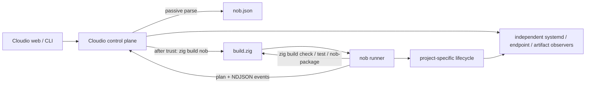

# nob.zig protocol v1: hybrid Zig build and Cloudio control plane

- Status: protocol/control-plane baseline implemented; real-project adoption in progress
- Audience: Cloudio and `nob.zig` implementers
- Protocol name: **nob.zig protocol v1**
- Static manifest: `nob.json`
Last updated: 2026-08-02

The external SDK, fixtures, examples, passive discovery, trust/bootstrap,
independent observation, persisted plan/run engine, CLI/API/web adapters,
logical secrets, scoped user-systemd and Caddy brokers, tombstones, and bounded
retention are implemented on `master`. The remaining definition-of-done items
in section 21 concern migrating representative production repositories and
their project-specific failure-injection suites, not unresolved control-plane
architecture.

## 1. Decision

nob.zig uses a hybrid architecture:

1. Each repository's `build.zig` remains the authority for compiling, checking,
   testing, and installing files into a staging prefix.
2. A small external Zig package named `nob.zig` (Zig import `nob`) provides the
   common runner API, protocol types, event writer, release-bundle helpers,
   and safe wrappers for recurring operations.
3. Each participating repository owns a tiny `src/nob.zig` executable.
   It contains the project-specific policy that cannot be inferred from a build
   graph: backups, migrations, promotion, health checks, rollback, and custom
   operational actions.
4. Cloudio is the control plane. It discovers manifests, asks for trust before
   executing repository code, builds and invokes runners, persists operations,
   applies authentication/idempotency/confirmation rules, independently
   observes resources, and presents the common API, CLI, and web UI.

The split is deliberate. `build.zig` is already Zig's build language and should
not be wrapped by a second general-purpose compiler frontend. Conversely,
deployment and process lifecycle are stateful host operations; forcing them
into build steps makes planning, authorization, long-running event reporting,
and rollback awkward. The runner bridges those domains without replacing
either one.



### 1.1 Non-negotiable invariants

- Discovery never executes repository code.
- A discovered repository is not trusted merely because it is under
  `projects_root`.
- A manifest contains declarations, never arbitrary shell command strings.
- Cloudio invokes `zig` and the runner with argument arrays, never through a
  shell.
- A runner may restrict the static manifest dynamically, but may not add new
  actions, resources, controls, or privilege requirements at runtime.
- Every mutating operation is planned before it is run.
- The exact plan bytes that Cloudio approves are the bytes given to `run`.
- The project runner owns project-specific correctness. Cloudio owns operator
  authorization, operation bookkeeping, and independent verification.
- `deploy` never fetches, pulls, resets, checks out, or otherwise changes the
  source checkout. Source synchronization is a separate future action.
- User systemd services are the v1 deployment default. System-scope mutation is
  disabled until a narrow privilege broker is implemented.
- `uninstall`, `purge`, and `forget` have different, fixed meanings. The UI and
  protocol do not use the ambiguous word `undeploy`.

### 1.2 Accepted tradeoffs

The hybrid gains a stable cross-project control surface, keeps each build usable
without Cloudio, supports genuinely project-specific recovery, and decouples
the Cloudio Zig version from project Zig versions. The costs are real: every
project carries a manifest and runner, the SDK/protocol need compatibility
tests, first use must build the runner, trust means executing repository code,
and Cloudio needs a persisted job/event engine rather than synchronous build
buttons. These costs are accepted because putting all lifecycle state into
`build.zig` would still require most of that control-plane machinery while
making build graphs responsible for host mutation and rollback.

## 2. Responsibilities by layer

| Concern | `build.zig` | Project runner | Cloudio |
|---|---|---|---|
| Compile/link/generate | Owns | Invokes named build steps | Records result |
| Unit/integration tests | Owns build graph | Invokes and summarizes | Schedules/displays |
| Package file selection | Owns install-to-prefix graph | Finalizes hashes and metadata | Records artifact |
| Backup/migration order | No | Owns | Displays and audits plan |
| Release promotion | No | Owns, normally through SDK helper | Independently observes |
| Health and rollback policy | No | Owns | Enforces timeout and records outcome |
| Project discovery | No | No | Owns, passive only |
| Trust and authorization | No | No | Owns |
| Idempotency and concurrency | No | Cooperates with operation ID | Owns |
| systemd start/stop/restart buttons | No | May use during a custom lifecycle | Owns generic resource controls |
| Persistent operation history | No | Emits events | Owns |
| Secrets mapping | No | Requests logical secret IDs | Owns mapping/delivery |

The runner is a normal executable, not a daemon and not a self-rebuilding build
tool. Zig already recompiles `build.zig` as needed. Cloudio bootstraps the runner
through a conventional build step and then invokes the resulting binary
directly, which also avoids a runner starting a nested build while an outer Zig
build process is still active.

## 3. Repository contract

A participating project has this minimum layout:

```text
project/
  build.zig
  build.zig.zon
  nob.json
  src/
    nob.zig
```

The repository pins a compatible `nob.zig` revision in
`build.zig.zon`. Its `build.zig` MUST expose:

- `nob`: builds and installs the runner as
  `<prefix>/bin/nob`.
- `check`: performs the repository's normal compile/static validation without
  deploying.
- `test`: when the repository has tests.
- `nob-package`: for deployable or distributable projects, installs the
  complete release payload below the supplied Zig prefix. It does not deploy.

`nob-package` is optional for a pure library that has no distributable
artifact. Other project-specific build steps are allowed, but only runner code
may choose to invoke them; their names are not executable manifest data.

The Cloudio bootstrap invocation is fixed:

```text
<resolved-zig> build nob -Doptimize=ReleaseSafe \
  --prefix <runner-cache> --cache-dir <runner-cache>/.zig-cache
```

The runner MUST appear at `<runner-cache>/bin/nob`. A repository can
exercise the same contract locally:

```text
zig build nob
./zig-out/bin/nob describe
```

### 3.1 Zig version compatibility

Zig compiler compatibility and protocol compatibility are independent:

- A project pins the SDK commit appropriate for its Zig compiler.
- `nob.zig` may publish compiler-qualified tags or branches, for
  example `v0.1.0-zig-0.16` and `v0.1.0-zig-0.17-dev`.
- Every compatible SDK speaks nob.zig protocol major version 1.
- Cloudio only consumes JSON and NDJSON from the runner. It does not load a
  project module into the Cloudio process and does not require the project and
  Cloudio to use the same Zig compiler.
- Cloudio may use the protocol-only portion of the SDK compiled with Cloudio's
  own Zig version, but protocol fixtures are the interoperability authority.

Toolchain resolution is owned by Cloudio, in this order:

1. An enrolled per-project absolute executable override.
2. The value read from the manifest's `runner.zig_version_file`, looked up in a
   Cloudio configuration map from version string to absolute executable.
3. `zig` resolved from Cloudio's sanitized `PATH`.

Cloudio records `zig version` with the built runner. It never downloads or
updates a compiler automatically.

## 4. Static manifest

`nob.json` is UTF-8 JSON, no larger than 256 KiB. It MUST be a regular
file at the project root. Duplicate object keys, invalid UTF-8, comments,
trailing non-whitespace bytes, and unknown fields outside `extensions` are
errors. The SHA-256 digest is calculated over the exact file bytes.

Here is a complete service example:

```json
{
  "schema": "nob.zig/manifest/v1",
  "project": {
    "id": "dev.tzekid.plosca",
    "display_name": "Plosca",
    "kind": "service",
    "description": "Personal web application",
    "tags": ["zig", "web"]
  },
  "runner": {
    "kind": "zig-build",
    "protocol": { "major": 1, "minor": 0 },
    "zig_version_file": ".zigversion"
  },
  "resources": [
    {
      "id": "web-service",
      "kind": "systemd.service",
      "label": "Web service",
      "ownership": "managed",
      "controls": ["start", "stop", "restart", "enable", "disable", "logs"],
      "spec": {
        "scope": "user",
        "unit": "plosca.service",
        "desired": { "enabled": true, "active": true },
        "environment_files": ["${XDG_CONFIG_HOME}/plosca/plosca.env"]
      }
    },
    {
      "id": "health",
      "kind": "endpoint.http",
      "label": "Health endpoint",
      "ownership": "observed",
      "controls": [],
      "depends_on": ["web-service"],
      "spec": {
        "url": "http://127.0.0.1:42110/healthz",
        "method": "GET",
        "expected_status": [200],
        "timeout_ms": 2000
      }
    },
    {
      "id": "releases",
      "kind": "release.directory",
      "label": "Installed releases",
      "ownership": "managed",
      "controls": [],
      "spec": {
        "root": "${HOME}/.local/opt/plosca",
        "current": "current",
        "keep": 5
      }
    },
    {
      "id": "database",
      "kind": "data.path",
      "label": "Application database",
      "ownership": "adopted",
      "controls": [],
      "spec": {
        "path": "${XDG_STATE_HOME}/plosca/plosca.db",
        "classification": "persistent",
        "backup_policy": "required-before-migrate",
        "purge": "runner-only"
      }
    },
    {
      "id": "route",
      "kind": "caddy.route",
      "label": "Public route",
      "ownership": "managed",
      "controls": ["enable", "disable"],
      "spec": {
        "host": "plosca.ru",
        "upstream": "127.0.0.1:42110"
      }
    }
  ],
  "actions": [
    {
      "id": "check",
      "label": "Check",
      "description": "Compile and statically validate the project",
      "executor": "runner",
      "effect": "workspace-write",
      "confirmation": "none",
      "source_policy": "any",
      "timeout_seconds": 900,
      "rollback": "none",
      "affects": [],
      "parameters": []
    },
    {
      "id": "deploy",
      "label": "Deploy",
      "description": "Package, promote, restart, health-check, and recover on failure",
      "executor": "runner",
      "effect": "runtime-change",
      "confirmation": "review-plan",
      "source_policy": "clean",
      "timeout_seconds": 1800,
      "rollback": "required",
      "affects": ["web-service", "health", "releases", "database", "route"],
      "parameters": [
        {
          "name": "optimize",
          "type": "enum",
          "required": false,
          "default": "ReleaseSafe",
          "values": ["ReleaseSafe", "ReleaseFast"]
        }
      ]
    },
    {
      "id": "rollback",
      "label": "Roll back",
      "description": "Promote a retained release and verify it",
      "executor": "runner",
      "effect": "runtime-change",
      "confirmation": "review-plan",
      "source_policy": "any",
      "timeout_seconds": 600,
      "rollback": "best-effort",
      "affects": ["web-service", "health", "releases"],
      "parameters": [
        {
          "name": "release_id",
          "type": "string",
          "required": true,
          "min_length": 1,
          "max_length": 128
        }
      ]
    },
    {
      "id": "uninstall",
      "label": "Uninstall",
      "description": "Remove runtime integration and releases but preserve data",
      "executor": "runner",
      "effect": "host-change",
      "confirmation": "review-plan",
      "source_policy": "any",
      "timeout_seconds": 600,
      "rollback": "best-effort",
      "affects": ["web-service", "health", "releases", "route"],
      "parameters": []
    },
    {
      "id": "purge",
      "label": "Purge",
      "description": "Uninstall and permanently delete declared persistent data",
      "executor": "runner",
      "effect": "data-destructive",
      "confirmation": "type-project-id",
      "source_policy": "any",
      "timeout_seconds": 600,
      "rollback": "none",
      "affects": ["web-service", "health", "releases", "database", "route"],
      "parameters": []
    }
  ],
  "secrets": [
    {
      "id": "database-token",
      "purpose": "Authenticate database administration during migration",
      "required_for": ["deploy"],
      "delivery": "file"
    }
  ],
  "extensions": {}
}
```

### 4.1 Identifier rules

- `project.id` is stable across path and display-name changes. It uses
  reverse-domain style and matches
  `[a-z][a-z0-9]*(\.[a-z][a-z0-9-]*)+`, with a maximum of 128 bytes.
- Resource IDs, action IDs, parameter names, and secret IDs match
  `[a-z][a-z0-9-]{0,63}`.
- IDs are compared byte-for-byte and are never inferred from a directory,
  service, executable, host, or repository name.
- A project may move. Cloudio reconciles a move only after matching the
  declared ID and repository identity and receiving operator confirmation.
- Two discovered roots declaring the same project ID are both marked
  `conflict`; neither may be trusted until the collision is resolved.
- Cloudio plan, operation, and scan IDs are 26-character Crockford Base32 ULIDs
  generated by Cloudio. Clients and runners never choose them. Database/project
  API identity remains the internal integer plus the declared project ID.

### 4.2 Top-level fields

| Field | Required | Contract |
|---|---:|---|
| `schema` | yes | Exactly `nob.zig/manifest/v1` |
| `project` | yes | Stable identity and presentation metadata |
| `runner` | yes | Fixed Zig bootstrap and protocol requirement |
| `resources` | yes | Static resource declarations; may be empty |
| `actions` | yes | Project-owned actions; may be empty |
| `secrets` | no | Logical requirements only; never secret values |
| `extensions` | no | Namespaced inert data, ignored by Cloudio v1 |

`project.kind` is one of `service`, `cli`, `library`, `benchmark`, or
`collection`. It is presentation metadata, not an authorization decision.
Display names and labels are non-empty plain text capped at 128 UTF-8 bytes;
descriptions are capped at 1,024 bytes; summaries at 2,048 bytes; tags at 32
items of 32 bytes each. Control characters other than line breaks in
descriptions are rejected.
One manifest may declare at most 128 resources, 64 actions, and 64 logical
secrets.

`runner.kind` MUST be `zig-build` in v1. The bootstrap step and output path are
fixed conventions and are therefore not fields that can be changed by a
manifest. `runner.protocol.major` MUST be `1`; Cloudio checks minor-version
compatibility after `describe`. `zig_version_file`, when present, is a safe
relative path below the project root and is limited to 4 KiB.

### 4.3 Path templates

Manifest paths may use only these variables:

- `${HOME}`
- `${XDG_CONFIG_HOME}`
- `${XDG_STATE_HOME}`
- `${XDG_CACHE_HOME}`
- `${PROJECT_ROOT}`

Cloudio supplies XDG defaults when the corresponding variable is absent. A
template must expand to an absolute path, may not contain `.` or `..` path
segments, and may not escape an allowed root through an existing symlink.
Before a destructive operation, the runner must resolve the exact target
again, prove that it is a strict descendant of the declared owner root, and
include that resolved path in the approved plan. Merely declaring a path never
authorizes Cloudio itself to recursively delete it.

### 4.4 Resource model

Every resource has `id`, `kind`, `label`, `ownership`, `controls`, and `spec`.
It may have `depends_on`, a unique list of other resource IDs. The dependency
graph must be acyclic. Dependency controls ordering/interpretation only; it
does not inherit permissions or ownership.

Ownership is one of:

- `managed`: the project lifecycle may create, rewrite, or remove the resource.
- `adopted`: the resource predates nob.zig. Allowed runtime controls
  may be used, but it is not rewritten or removed until an explicit adoption
  plan records the ownership marker.
- `observed`: read only. No mutating controls are valid.

Cloudio v1 understands these resource kinds:

| Kind | Required `spec` fields | Independent observation |
|---|---|---|
| `systemd.service` | `scope`, `unit`, `desired`; optional `environment_files` | exact scope/unit state, enablement, PID, fragment path |
| `endpoint.http` | `url`, `method`, `expected_status`, `timeout_ms` | bounded HTTP request |
| `endpoint.tcp` | `host`, `port`, `timeout_ms` | TCP connect |
| `release.directory` | `root`, `current`, `keep` | current link, retained release manifests |
| `artifact.executable` | `release_resource`, `path` | existence, mode, digest where affordable |
| `data.path` | `path`, `classification`, `backup_policy`, `purge` | existence and metadata, never contents |
| `caddy.route` | `host`, `upstream` | desired route plus captured runtime route |
| `docker.compose` | `file`, `project_name`, optional `services` | compose/container state; read-only in the first Cloudio milestone |
| `process` | `match`, optional `pid_file` | process/socket correlation; observed only |

Unknown kinds are retained and displayed as generic resources, but Cloudio
offers no direct controls for them. An extension cannot turn an unknown kind
into an executable capability.

For `systemd.service`:

- `scope` is `user` or `system` and is part of resource identity. The same unit
  name in both scopes denotes two resources.
- `unit` MUST end in `.service`, contain no slash or whitespace, not begin with
  `-`, and contain only systemd unit-name characters.
- User scope means the same account that runs Cloudio. Managing another user's
  session is out of scope for v1.
- `desired` contains at least one of boolean `enabled` and `active`. It is an
  observation/reconciliation target, not permission to mutate by itself.
- Each `environment_files` entry is an absolute path template. Prefix `-` and
  other systemd optional-file syntax are forbidden; optionality is represented
  explicitly in a future schema instead of overloaded string syntax.
- Valid controls are `start`, `stop`, `restart`, `reload`, `enable`, `disable`,
  and `logs`.
- A control is allowed only when declared. `logs` is read-only; the others are
  mutations and go through the same plan/operation machinery as actions.
- System-scope resources can be observed in v1. Their mutating controls report
  `unsupported-privilege` until the privilege broker in section 15.6 exists.

HTTP health URLs MUST be loopback HTTP or HTTPS in v1. They may not contain
userinfo, fragments, or credentials. Redirects are disabled. Response bodies
are capped at 64 KiB and discarded after an optional exact health assertion.
This prevents a manifest from turning scheduled observation into an arbitrary
network scanner.

The remaining v1 kind-specific validation is fixed:

- `endpoint.http.method` is `GET` or `HEAD`; `expected_status` contains 1 to 8
  integers from 100 through 599; `timeout_ms` is 100 through 30,000.
- `endpoint.tcp.host` is `127.0.0.1`, `::1`, or `localhost`; `port` is 1 through
  65535; `timeout_ms` has the same bound.
- `release.directory.root` is an absolute path template;
  `current` is a single safe basename; `keep` is 2 through 50. Its managed
  descendants are only `<release-id>`, `<release-id>.partial`, and the current
  symlink.
- `artifact.executable.release_resource` names a declared
  `release.directory`; `path` is a safe relative bundle path.
- `data.path.classification` is `persistent` or `cache`;
  `backup_policy` is `none`, `recommended`, or `required-before-migrate`;
  `purge` is `never` or `runner-only`. Cache classification does not override
  `purge=never`.
- `caddy.route.host` is one normalized DNS hostname with no wildcard in v1;
  `upstream` is a loopback `host:port`. Raw Caddy directives are not accepted.
- `docker.compose.file` is a safe relative path below the project root and
  `project_name` follows Compose project-name syntax. This kind is observed
  only in the first milestone even if controls are mistakenly declared.
- `process.match` is an informational exact executable basename, not a regular
  expression or command. `process` ownership MUST be `observed`, with no
  controls. A PID file is supporting evidence, never ownership proof by itself.

For every kind, `ownership=observed` requires an empty controls array. The
parser rejects duplicate controls, references to undeclared resources, and
kind/control combinations outside the table above.

### 4.5 Action model

Project-owned actions are executed by the runner. The runner may report an
action unavailable, but it cannot introduce an undeclared action.
`executor` MUST be `runner` in v1. `affects` contains unique IDs from the same
manifest. `timeout_seconds` is 1 through 21,600. Labels/descriptions use the
global presentation bounds, and action/parameter arrays are capped at 64 items
each.

`effect` is one of:

- `read-only`: no persistent state change.
- `workspace-write`: may change build caches or declared workspace output, but
  not installed runtime state.
- `runtime-change`: may interrupt or replace a running workload.
- `host-change`: may change installed files, units, or routes while preserving
  declared persistent data.
- `data-destructive`: may permanently remove persistent data.

`confirmation` is one of `none`, `review-plan`, or `type-project-id`. Cloudio
may require stronger confirmation than the manifest requests, never weaker.
All HTTP execution endpoints still require Cloudio's mutation idempotency and
confirmation headers; the field controls the additional user experience.

`source_policy` is one of:

- `any`: a dirty checkout is allowed and its fingerprint is included in the
  plan.
- `clean`: Git repositories must have no tracked, untracked, or submodule
  changes.
- `exact-revision`: input must name the revision, the checkout must be clean,
  and `HEAD` must equal it.

`rollback` is `none`, `best-effort`, or `required`. A `required` action is not
available unless its plan identifies a recovery target and its handler can
attempt recovery after the first irreversible step.

Parameters use a deliberately small schema. Types are `string`, `boolean`,
`integer`, and `enum`; supported constraints are `required`, `default`,
`min_length`, `max_length`, `minimum`, `maximum`, and `values` as appropriate.
Unknown parameters and duplicate parameters are errors. A normalized input
document is capped at 64 KiB. Secret values are forbidden as parameters.

### 4.6 Standard action semantics

The following IDs have fixed meanings when declared:

| Action | Meaning |
|---|---|
| `check` | Compile/static validation; no installed artifact |
| `test` | Run the project's test graph |
| `build` | Produce ordinary local build output |
| `package` | Produce and validate a release bundle without installing it |
| `deploy` | Package, install/promote, activate, health-check, recover if necessary |
| `rollback` | Promote an already retained release, activate, and health-check |
| `uninstall` | Remove units/routes/releases installed by the project; preserve all `data.path` resources |
| `purge` | Perform uninstall and delete only explicitly declared purgeable data after typed confirmation |

`forget` is Cloudio-only: it removes active trust/registration by creating an
ignored audit tombstone and does not invoke a runner or touch the project,
runtime, releases, units, routes, or data.
Start/stop/restart/enable/disable/logs are controls on a resource, not duplicate
project actions. A custom action may use a namespaced purpose-specific ID such
as `backup-database` or `run-benchmark`.

### 4.7 Secrets

The manifest declares logical IDs and purposes, not secret locations or values.
At enrollment, Cloudio maps each ID to an existing local secret source. The
database stores the mapping label and presence state, never the value.

V1 source kinds are `file` and `process-environment`. A file source is an
absolute, non-symlink regular file owned by the Cloudio account and readable
only by that account (mode 0600 or stricter). A process-environment source is
the exact name of a variable explicitly mapped by the operator; Cloudio does
not pass the rest of its environment to the runner. API/CLI requests carry only
the source kind and reference, never the resolved bytes.

For an invocation, Cloudio creates a mode-0700 operation secret directory,
writes each required secret to a mode-0400 file named by its logical ID, and
sets `NOB_SECRET_DIR` for `run` only. `describe`, `observe`, and `plan`
receive only a sorted list of present logical IDs, never resolved bytes. The SDK
exposes `secretPath(id)` only on `RunContext`; it does not return or log the
value. The directory is removed after the child exits and is cleaned as stale
state after a Cloudio crash.

Long-lived service credentials are not copied from this ephemeral directory.
A systemd resource may reference stable, operator-provisioned
`environment_files`. Cloudio observes presence, ownership, and permissions but
does not read or display their contents. Secret bytes are forbidden in the
manifest, operation input, plan, event stream, argv, artifact metadata, and
audit detail.

## 5. Runner executable and SDK

The project runner should be small enough to review. A typical source file is
conceptually:

```zig
const ops = @import("nob");

pub fn main(init: std.process.Init) !void {
    return ops.dispatch(init, .{
        .project_id = "dev.tzekid.plosca",
        .observe = observe,
        .actions = &.{
            ops.action("check", planCheck, runCheck),
            ops.action("deploy", planDeploy, runDeploy),
            ops.action("rollback", planRollback, runRollback),
            ops.action("uninstall", planUninstall, runUninstall),
            ops.action("purge", planPurge, runPurge),
        },
    });
}
```

This is an API-shape requirement, not a promise that those exact Zig syntax
details remain source-compatible across compiler-qualified SDK releases.

The SDK public concepts are:

- `Definition`: project ID, observe callback, and action callback table.
- `ObserveContext`: allocator/I/O, canonical root, source fingerprint, logical
  secret presence, and a resource-result builder.
- `PlanContext`: validated action input, manifest digest, source state, resolved
  paths, and plan builder. It has no mutation helpers.
- `RunContext`: the exact parsed plan, operation directories, resolved Zig
  executable, cancellation token, event writer, bundle helper, and typed
  user-systemd helper.
- `PlanBuilder`: preconditions, affected resources, ordered stages, expected
  downtime, rollback target/mode, and operator notes.
- `EventWriter`: sequence assignment, bounded JSON encoding, redaction hooks,
  stage/progress/log/artifact/resource/final helpers.
- `Bundle`: safe staging traversal, hashing, release-manifest generation,
  immutable install, current-link promotion, retention, and recovery.
- `UserSystemd`: exact declared user-unit operations through Cloudio's
  per-operation broker when present, with an explicit direct local backend for
  standalone development, ownership-marker checks, and event reporting.

At startup, SDK dispatch reads the root `nob.json`, hashes the exact
bytes, compares the digest with `NOB_MANIFEST_SHA256`, validates it, and
requires the compiled callback/resource table to be a subset of that manifest.
Contexts and typed helpers receive this validated declaration. A normal runner
therefore cannot accidentally operate a unit, path, secret, or action that was
only present in source code and absent from the reviewed manifest.

Plan callbacks MUST be observational. They may read files and query processes,
but may not build, download, write, stop, start, migrate, or otherwise mutate.
This cannot be made a security boundary once repository code is trusted, so it
is also covered by SDK tests and review conventions.

## 6. Process protocol

The runner exposes four commands:

```text
nob describe
nob observe
nob plan <action-id>
nob run <action-id> --operation-id <id> --plan-digest <sha256>
```

- `describe` and `observe` take no stdin and emit one JSON object on stdout.
- `plan` reads one action-request JSON object from stdin and emits one plan JSON
  object on stdout.
- `run` reads the exact approved plan bytes from stdin and emits NDJSON events
  on stdout until a terminal event.
- Stdout is reserved for protocol data. Human/bootstrap diagnostics go to
  stderr. An interactive prompt is always a protocol error.
- Every JSON schema discriminator below is exact.

### 6.1 Invocation environment

Cloudio sets the child working directory to the canonical project root and
starts a new process group. It supplies a sanitized environment containing:

- `PATH`, `HOME`, `USER`, `LANG`, `LC_*`, `TZ` when available.
- `XDG_CONFIG_HOME`, `XDG_STATE_HOME`, `XDG_CACHE_HOME`, `XDG_RUNTIME_DIR`.
- `DBUS_SESSION_BUS_ADDRESS` only for user-systemd operation.
- `NOB_PROJECT_ROOT`.
- `NOB_MANIFEST_SHA256`.
- `NOB_SOURCE_FINGERPRINT`.
- `NOB_OPERATION_DIR` for `run`.
- `NOB_ARTIFACT_DIR` for `run`.
- `NOB_AVAILABLE_SECRETS`, sorted comma-separated logical IDs whose
  bindings currently resolve, after trust.
- `NOB_SECRET_DIR` for `run` only, and only when required secrets were
  resolved.
- `NOB_BROKER_SOCKET` and `NOB_BROKER_TOKEN_FILE` for Cloudio
  `run` invocations that have approved broker requests.
- `NOB_ZIG`, the resolved absolute Zig executable.
- `NOB_CLOUDIO_VERSION`.

Provider tokens and the rest of Cloudio's process environment are not inherited
by default. A project-specific non-secret environment allowlist is Cloudio
configuration, not executable manifest content.

### 6.2 `describe`

Example response:

```json
{
  "schema": "nob.zig/describe/v1",
  "protocol": { "major": 1, "minor": 0, "features": ["ndjson-events", "exact-plan-bytes"] },
  "project_id": "dev.tzekid.plosca",
  "manifest_sha256": "6f2b...64-hex-characters...",
  "runner": {
    "sdk_version": "0.1.0",
    "build_id": "a9d1...",
    "zig_version": "0.16.0-dev.1234+abcd"
  },
  "actions": [
    { "id": "check", "available": true, "reason": null },
    { "id": "deploy", "available": false, "reason": "missing secret: database-token" }
  ],
  "resources": [
    { "id": "web-service", "observable": true }
  ]
}
```

The response may only mention statically declared action and resource IDs.
Cloudio rejects mismatched project/manifest identity, a protocol major other
than 1, duplicate IDs, or a runner that claims a capability absent from the
manifest. Dynamic availability can only narrow what is offered.

### 6.3 `observe`

Example response:

```json
{
  "schema": "nob.zig/observe/v1",
  "project_id": "dev.tzekid.plosca",
  "manifest_sha256": "6f2b...",
  "source": {
    "kind": "git",
    "revision": "c1f27b...",
    "dirty": false,
    "fingerprint": "89ad..."
  },
  "status": "degraded",
  "summary": "service is active but health check is failing",
  "resources": [
    {
      "id": "web-service",
      "status": "healthy",
      "summary": "active",
      "facts": { "migration_version": 17 }
    },
    {
      "id": "health",
      "status": "degraded",
      "summary": "HTTP 503",
      "facts": {}
    }
  ]
}
```

Project status is `healthy`, `degraded`, `stopped`, `missing`, or `unknown`.
Resource facts are informational JSON scalars/arrays/objects capped at 64 KiB
per resource; they do not grant controls. Unknown resource IDs are a protocol
error. Cloudio records its own observation separately and marks a discrepancy
instead of letting the runner overwrite independent evidence.

### 6.4 `plan`

Cloudio writes this request to stdin after normalizing and validating parameters:

```json
{
  "schema": "nob.zig/action-request/v1",
  "plan_id": "01J...",
  "project_id": "dev.tzekid.plosca",
  "action_id": "deploy",
  "parameters": { "optimize": "ReleaseSafe" }
}
```

`plan_id` is the ID of the pending `project_plans` row reserved by Cloudio. It
is not the later run operation ID and cannot be chosen by the caller.

The runner returns one object:

```json
{
  "schema": "nob.zig/plan/v1",
  "project_id": "dev.tzekid.plosca",
  "action_id": "deploy",
  "manifest_sha256": "6f2b...",
  "source": {
    "revision": "c1f27b...",
    "dirty": false,
    "fingerprint": "89ad..."
  },
  "parameters": { "optimize": "ReleaseSafe" },
  "effect": "runtime-change",
  "confirmation": "review-plan",
  "expected_downtime_seconds": 5,
  "preconditions": [
    { "id": "source-clean", "status": "satisfied", "summary": "Git worktree is clean" },
    { "id": "recovery-release", "status": "satisfied", "summary": "release c0ffee is healthy" }
  ],
  "affected_resources": ["web-service", "health", "releases", "database", "route"],
  "stages": [
    { "id": "package", "label": "Build release bundle", "reversible": true },
    { "id": "backup", "label": "Back up database", "reversible": true },
    { "id": "migrate", "label": "Apply database migrations", "reversible": false },
    { "id": "promote", "label": "Promote immutable release", "reversible": true },
    { "id": "restart", "label": "Restart user service", "reversible": true },
    { "id": "health", "label": "Verify health", "reversible": true }
  ],
  "broker_requests": [
    { "id": "restart-web", "capability": "systemd.control", "resource_id": "web-service", "operation": "restart" },
    { "id": "enable-route", "capability": "caddy.route", "resource_id": "route", "operation": "enable" }
  ],
  "rollback": {
    "mode": "automatic",
    "target": "c0ffee",
    "data": "forward-only-migration"
  },
  "notes": ["Database migrations are forward-only; binary rollback remains supported"]
}
```

Precondition status is `satisfied`, `unsatisfied`, or `unknown`. Cloudio never
runs a plan containing an unsatisfied precondition. An unknown precondition
requires explicit review and is forbidden for a `required` rollback action.

Cloudio validates the object, stores its exact stdout bytes, and computes:

```text
plan_digest = SHA-256(exact_plan_stdout_bytes)
```

There is no JSON canonicalization dependency. The exact bytes, including a
single final newline when emitted, are retained and later provided unchanged
to `run`. A plan is valid for 10 minutes by default, may be used once, and is
invalidated by a manifest change, trust change, project operation, or source
fingerprint change.

### 6.5 `run` events

The runner reads the exact plan from stdin, recomputes the digest, checks the
CLI digest, then revalidates project ID, action ID, manifest digest, source
fingerprint, parameters, and live preconditions before its first mutation.

It writes one compact JSON object per line. `seq` starts at 1 and increases by
exactly one. The required event types are:

```json
{"schema":"nob.zig/event/v1","seq":1,"type":"operation-started","action_id":"deploy"}
{"schema":"nob.zig/event/v1","seq":2,"type":"stage-started","stage_id":"package","label":"Build release bundle"}
{"schema":"nob.zig/event/v1","seq":3,"type":"log","level":"info","stage_id":"package","message":"building ReleaseSafe"}
{"schema":"nob.zig/event/v1","seq":4,"type":"progress","stage_id":"package","current":1,"total":1,"unit":"step"}
{"schema":"nob.zig/event/v1","seq":5,"type":"artifact","artifact_id":"release:c1f27b","role":"release-bundle","path":"...","sha256":"...","size_bytes":4819320}
{"schema":"nob.zig/event/v1","seq":6,"type":"stage-finished","stage_id":"package","outcome":"succeeded"}
{"schema":"nob.zig/event/v1","seq":7,"type":"resource-state","resource_id":"web-service","status":"healthy","summary":"active"}
{"schema":"nob.zig/event/v1","seq":8,"type":"operation-finished","outcome":"succeeded","summary":"deployed c1f27b"}
```

Additional lifecycle event types are `rollback-started` and
`rollback-finished`. Log levels are `debug`, `info`, `warning`, and `error`.
Stage outcomes are `succeeded`, `failed`, `skipped`, or `canceled`. The terminal
operation outcome is one of:

- `succeeded`
- `failed`
- `canceled`
- `failed-rolled-back`
- `failed-rollback-failed`
- `interrupted`

Exactly one `operation-finished` event is required. The SDK emits it when a
handler returns normally or with a classified error. If the process dies first,
Cloudio synthesizes `interrupted` and clearly marks that event as
`source: cloudio`.

An event line is limited to 64 KiB. A log message is limited to 8 KiB after
UTF-8 normalization and redaction. The runner should emit a structural,
progress, or heartbeat log event at least every 30 seconds. Cloudio uses its
receipt time as authoritative and treats optional runner timestamps as display
metadata only.

### 6.6 Limits and timeouts

| Command | stdout limit | stderr limit | timeout |
|---|---:|---:|---:|
| `describe` | 1 MiB | 256 KiB | 30 s |
| `observe` | 1 MiB | 256 KiB | 60 s |
| `plan` | 1 MiB | 256 KiB | 60 s |
| `run` | 64 KiB per event; 64 MiB retained stream | 1 MiB retained | manifest action timeout, max 6 h |

Cloudio continues draining a run stream after the retained-log cap so the child
cannot deadlock, but drops excess `log` events and records a truncation counter.
Structural events remain eligible for persistence. Protocol parsing is
incremental; Cloudio never buffers the complete run stream in memory.

### 6.7 Exit codes

| Code | Meaning |
|---:|---|
| 0 | Successful command / terminal `succeeded` |
| 2 | Invalid invocation, input, manifest, or protocol document |
| 3 | Action unavailable or precondition changed |
| 4 | Project busy |
| 5 | Required secret or permission unavailable |
| 10 | Action failed without successful rollback |
| 11 | Action failed and rollback succeeded |
| 12 | Action failed and rollback also failed |
| 130 | Cooperative cancellation |

For `run`, the terminal event is the semantic result and the exit code is a
consistency check. A mismatch marks the operation `protocol-error` and triggers
independent observation.

### 6.8 Cancellation and interruption

Cloudio sends `SIGTERM` to the runner's process group. The SDK turns that into a
cancellation token. A handler checks the token between stages and during long
helpers. Plans may mark the first non-cancellable stage in their notes; the UI
disables ordinary cancellation once that stage begins. Administrative process
termination remains possible but is reported as an interruption, not a clean
cancel.

After 15 seconds without exit Cloudio sends `SIGKILL`. It never claims rollback
occurred unless the runner emitted `rollback-finished: succeeded`. Every
canceled, killed, timed-out, protocol-error, or crash-recovered operation is
followed by independent resource observation. Mutating operations are never
automatically retried.

### 6.9 Per-operation control broker

A runner sometimes needs a generic host action at a precise lifecycle point:
restart the declared user service after promotion, enable its exact Caddy route,
or install a reviewed user-unit rendering. Cloudio exposes those actions through
a temporary typed broker rather than a general Cloudio API token or shell.

The runner plan's optional `broker_requests` array is an authorization request,
not an action. It is capped at 32 unique entries. Each entry has `id`,
`capability`, `resource_id`, `operation`, and capability-specific immutable
metadata such as an expected content digest. Cloudio accepts an entry only when:

- the resource is statically declared and listed in the action's `affects`;
- ownership and controls permit the exact operation; lifecycle `install` and
  `remove` additionally require a managed resource and the standard
  deploy/uninstall/purge action as applicable;
- the operation's computed effect does not exceed the reviewed action effect;
- any unit/route/path values exactly match the static declaration; and
- system scope or another unsupported privilege is not requested.

V1 broker capabilities are:

| Capability | Operations | Additional rule |
|---|---|---|
| `systemd.control` | `start`, `stop`, `restart`, `reload`, `enable`, `disable` | exact declared user unit and control |
| `systemd.unit` | `install`, `remove` | managed user unit, ownership marker, approved rendered SHA-256 |
| `caddy.route` | `enable`, `disable`, `remove` | exact declared host/upstream; remove requires managed ownership and uninstall/purge |

Before starting `run`, Cloudio creates a Unix socket and 256-bit random token in
the mode-0700 operation directory. The socket is mode 0600; the token file is
mode 0400. On Linux Cloudio also checks `SO_PEERCRED` against the child account
and process group. The socket accepts sequential request/response JSON frames,
each capped at 64 KiB:

```json
{"schema":"nob.zig/broker-request/v1","request_id":1,"operation_id":"01J...","authorization_id":"restart-web","token":"...","payload":{}}
```

```json
{"schema":"nob.zig/broker-response/v1","request_id":1,"ok":true,"before":{"active":"active"},"after":{"active":"active"},"error":null}
```

Cloudio looks up `authorization_id` in the exact stored plan; the request cannot
substitute capability, resource, operation, unit, scope, host, upstream, path,
or content digest. A unit-install payload is a path strictly inside the
operation artifact directory plus the planned SHA-256; Cloudio reads and
validates it without accepting arbitrary destination paths. Every broker call
gets an `audit_actions` row tied to operation, actor, and idempotency key.
The corresponding plan authorization contains the complete secret-free
rendered unit text (maximum 64 KiB), its digest, and a bounded diff against the
current fragment, so the operator reviews content rather than an opaque hash.

The broker closes before the project lock is released. Tokens and sockets are
removed on normal exit and crash recovery and are never persisted in event or
audit output. Broker failure is an action failure handled by the runner's
declared recovery path.

The first implementation runs one broker-serving thread per active runner so
the main worker can continuously drain stdout/stderr and enforce timeouts. The
broker thread receives an immutable in-memory authorization set, opens its own
initialized SQLite connection for audit writes, accepts only one runner
connection, and is joined before operation finalization. Closing the listener
and connection is part of cancellation.

When invoked outside Cloudio, SDK helpers may use a direct user-systemd backend
only after the operator sets `NOB_LOCAL_CONTROL=1`; broker-dependent
Caddy or managed-unit writes otherwise report permission unavailable. This
keeps check/test/package useful as ordinary local workflows without silently
bypassing Cloudio during a managed invocation.

## 7. Source identity and runner bootstrap

### 7.1 Repository identity

For a Git repository Cloudio records:

- canonical project root;
- filesystem device/inode where available;
- declared project ID;
- normalized `remote.origin.url` when present;
- Git common-directory identity for worktrees;
- `HEAD` revision;
- clean/dirty state;
- manifest SHA-256.

Absence of a remote is valid. Cloudio does not contact the remote during
discovery, planning, or deployment.

For clean Git worktrees, the source fingerprint includes `HEAD`, submodule
commits, and the manifest digest. For dirty worktrees the SDK hashes sorted
records from `git ls-files -co --exclude-standard -z`, including each path,
mode, and file content digest. Repositories that are not Git-backed use the same
sorted path/mode/content algorithm over an explicit runner-owned source set.

### 7.2 Trust states

The state machine is:

```text
discovered -> trusted -> review-required -> trusted
     |            |              |
   invalid      revoked        revoked
     |
   missing (when the root disappears; history retained)
```

`invalid` and `conflict` are discovery conditions, not executable states.
Enrollment displays and binds the declared ID, canonical root, repository
identity, manifest digest, resource ownership, direct controls, actions,
effects, systemd scopes, and requested secrets. Trust records the actor and
time.

Any manifest byte change moves a trusted project to `review-required`; no
runner code is executed until the new digest is approved. Ordinary source code
changes do not revoke repository trust, because building changed code is the
normal use case, but every plan shows and binds the exact source fingerprint.
A root/repository identity change always requires review.

### 7.3 Cache layout

Cloudio uses XDG roots, configurable explicitly:

```text
$XDG_CACHE_HOME/cloudio/nob/runners/
  <internal-project-id>/
    <manifest-sha256>/
      <clean-git-revision>/
        bin/nob
        runner.json

$XDG_STATE_HOME/cloudio/nob/operations/
  <operation-id>/
    request.json
    plan.json
    events.ndjson
    stderr.log
    artifacts/
    secrets/                 # temporary; removed after exit
```

A clean revision may reuse a runner after its recorded executable digest and
`describe` identity validate. A dirty checkout uses an operation-specific
cache and is never reused. Bootstrap output is bounded and persisted as
redacted diagnostics. A partially built cache is created with a `.partial`
suffix and atomically renamed only after `describe` succeeds.

Cloudio rebuilds when the manifest digest, clean revision, Zig executable/version,
or relevant build metadata changes. It may conservatively rebuild when unsure;
it must never reuse a runner across projects.

### 7.4 Cloudio configuration

Add a `[nob]` section with these exact settings and defaults:

```toml
[nob]
enabled = true
scan_depth = 3
observe_seconds = 300
plan_ttl_seconds = 600
plan_retention_days = 7
operation_retention_days = 30
min_operations_per_project = 20
worker_count = 1
state_root = "${XDG_STATE_HOME}/cloudio/nob/operations"
cache_root = "${XDG_CACHE_HOME}/cloudio/nob/runners"
max_run_log_bytes = 67108864
toolchains_file = "${XDG_CONFIG_HOME}/cloudio/nob/toolchains.json"
allow_system_mutation = false
```

`projects_root` remains the sole scan root in the first milestone. A later
`scan_roots` list can generalize it without changing the manifest/protocol.
Environment overrides use the existing naming convention, for example
`CLOUDIO_NOB_ENABLED`, `CLOUDIO_NOB_STATE_ROOT`, and
`CLOUDIO_NOB_TOOLCHAINS_FILE`. `worker_count` is accepted from 1 through
4, though v1 still serializes mutations per project.

The toolchains file is non-secret, mode 0644 or stricter, and has this shape:

```json
{
  "schema": "nob.zig/toolchains/v1",
  "zig": {
    "0.16.0-dev.1234+abcd": "/home/kid/.local/zig/0.16/zig",
    "0.17.0-dev.5678+ef01": "/home/kid/.local/zig/0.17/zig"
  }
}
```

Keys must exactly equal the trimmed version-file contents. Values must be
absolute paths to executable regular files. Cloudio records the actual
`zig version` and rejects a mapping whose executable reports a different
version. Variable expansion in nob.zig path settings happens once
during configuration load; unresolved variables are errors.

## 8. Release bundle contract

The normal package helper creates an empty operation staging directory and
invokes:

```text
<resolved-zig> build nob-package -Doptimize=<profile> \
  --prefix <bundle-dir> --cache-dir <operation-dir>/zig-cache
```

`build.zig` decides what is installed. After the build exits successfully, the
runner SDK walks the bundle, rejects unsafe entries, hashes it, and writes
`release.json` at the root:

```json
{
  "schema": "nob.zig/release/v1",
  "project_id": "dev.tzekid.plosca",
  "release_id": "c1f27b9-01JABC",
  "source": {
    "kind": "git",
    "revision": "c1f27b9...",
    "dirty": false,
    "fingerprint": "89ad..."
  },
  "build": {
    "zig_version": "0.16.0-dev.1234+abcd",
    "optimize": "ReleaseSafe",
    "target": "x86_64-linux-gnu"
  },
  "entrypoints": [
    { "id": "web", "path": "bin/plosca" }
  ],
  "files": [
    { "path": "bin/plosca", "kind": "file", "mode": "0555", "size_bytes": 4819320, "sha256": "..." }
  ]
}
```

Bundle validation rules:

- `release_id` matches `[A-Za-z0-9][A-Za-z0-9._-]{0,127}`.
- All entries are relative UTF-8 paths with no empty, `.` or `..` segment.
- Regular files and directories are allowed. Symlinks, hard links, devices,
  sockets, FIFOs, setuid/setgid bits, and world-writable entries are rejected in
  v1.
- No entry may escape the staging root during traversal or installation.
- File count, individual size, and total size use configurable caps; defaults
  are 10,000 files, 512 MiB per file, and 2 GiB total.
- `release.json` is not included in its own file hash list. Its exact bytes are
  separately hashed as the artifact digest.
- Entry points must name listed executable regular files.
- Runtime-mutated state, caches, uploaded files, and databases do not belong in
  the release bundle.

Installation copies or atomically renames the validated staging tree to a
`.partial` directory below the declared `release.directory`, applies immutable
read/execute modes, fsyncs where supported, and atomically renames it to the
release ID. Promotion creates a temporary relative symlink and renames it over
`current`. A release is never modified after promotion.

## 9. Default deploy lifecycle

The SDK should offer a standard lifecycle builder, while allowing a project to
insert domain-specific stages:

1. **Revalidate** exact plan, trust digest, source fingerprint, resolved paths,
   free space, required secrets, service ownership, and recovery target.
2. **Package** into a fresh staging directory through `nob-package`.
3. **Validate** the bundle and generate `release.json`.
4. **Back up** every data resource whose policy requires a backup for the
   planned migration. Validate the backup before continuing.
5. **Install** a new immutable release without changing `current`.
6. **Quiesce/migrate** according to project policy. A plan explicitly says
   whether migration is backward-compatible, reversible, or forward-only.
7. **Promote** the `current` link atomically.
8. **Activate** changed user units/routes and restart or reload the service
   through approved per-operation broker requests.
9. **Health-check** all required endpoints until their shared deadline.
10. **Finalize** artifact metadata and retention only after health succeeds.
11. **Recover on failure** after promotion by restoring the previous link,
    restarting, and health-checking it. Data restore occurs only when the plan
    declared it safe; a forward-only migration uses binary compatibility or a
    forward fix instead.
12. **Observe** resources independently from Cloudio after the runner exits.

A project such as Sparkdate can keep its mature backup/migration/health logic
inside its runner handler while replacing its shell/nohup process control with
the same declared user-systemd resource as other services. A simple service can
compose the SDK's default helpers with very little project code.

### 9.1 Failure semantics

- Failure before promotion removes staging and leaves runtime untouched.
- Failure after installing but before promotion leaves an unreferenced release
  eligible for later cleanup and leaves runtime untouched.
- Failure after promotion triggers the declared recovery strategy.
- A successful binary rollback after a forward-only migration yields
  `failed-rolled-back` only if the old binary is declared compatible and passes
  health.
- If recovery health fails, outcome is `failed-rollback-failed`; Cloudio does
  not relabel it merely `failed`.
- Release retention never deletes the current or rollback target. Cleanup is a
  separate final stage and its failure degrades an otherwise successful result
  rather than undoing a healthy deployment.

## 10. Cloudio discovery and reconciliation

Cloudio replaces compose-only project discovery with a passive scanner written
in Zig. It scans configured roots (initially the existing `projects_root`) to a
default depth of 3 and skips `.git`, `.zig-cache`, `zig-cache`, `zig-out`,
`node_modules`, `target`, `vendor`, `zig-pkg`, and hidden cache directories.

Rules:

1. A directory containing `nob.json` is a declared project root and is
   not traversed for nested projects unless explicitly configured.
2. A Git root, `build.zig`, or top-level Compose file without a manifest is a
   passive `candidate`. It appears in the UI with an “Add nob.zig”
   hint but has no actions.
3. Scanner parsing is bounded and performs no toolchain lookup, Git network
   operation, build, `describe`, or `observe` call.
4. Every scan has an ID. Rows seen in the scan are updated; previously known
   rows not seen become `missing`. They are not silently deleted.
5. Invalid manifests retain path, digest, and bounded diagnostics so they can
   be fixed.
6. Candidate/manifest paths are canonicalized. A symlink target must remain
   inside a configured scan root.
7. Manifest/resource/action rows are replaced transactionally only after the
   complete manifest validates.

For trusted projects, scheduled reconciliation has two evidence sources:

- **Cloudio observation:** systemd, endpoint, release, executable, data-path
  metadata, Caddy, Docker, socket, and process collectors using exact declared
  identities.
- **Runner observation:** project-specific facts such as schema version,
  internal queue state, or domain health.

Cloudio stores both. Effective state is conservative: a material disagreement
is `degraded` with both claims shown. Exact resource declarations replace the
current topology guesses based on `<directory-name>.service` or Compose-style
container names, though legacy correlations remain available for candidates.

Merge rules are deterministic:

1. Manifest invalid, trust review required, observer error, or evidence older
   than twice the configured interval prevents an effective `healthy` result.
2. For understood kinds, Cloudio observation is authoritative for existence,
   process/unit state, endpoint reachability, current-release identity, and
   route state. Runner facts may enrich but not override it.
3. If either source reports `degraded` while the other reports `healthy`, the
   effective state is `degraded` with `observation-disagreement`.
4. `stopped` is used when a declared runtime is cleanly inactive. A dependent
   endpoint that is unreachable solely because that runtime is stopped also
   resolves to `stopped`, not `degraded`. A missing managed resource is
   `missing`, not stopped.
5. For unknown resource kinds, runner state is displayed as `unverified`; it
   cannot make the whole project healthy by itself.
6. Project state is the worst required-resource state in this order:
   `missing`, `degraded`, `unknown`, `stopped`, `healthy`. Optional-resource
   semantics are deferred; all declared v1 resources are required.
7. A project with no resources (normally a library/CLI) uses current
   manifest/runner/source observation: valid, trusted, non-stale evidence is
   `healthy`; dirty source is informational unless an action forbids it.

Trusted runner observation defaults to every 300 seconds, with a minimum of 60
seconds. Untrusted/review-required projects receive only static manifest state
and correlations against data Cloudio already collected globally. Cloudio does
not probe their endpoints, invoke `systemctl`/`journalctl` on their behalf, read
their declared paths, or run their runner. `describe` runs after bootstrap and
whenever the cached runner identity changes, not on every refresh.

## 11. Persistence

Migration 13 is named `nob_v1`. Existing `projects`,
`apps`, `deploys`, `app_operation_locks`, `mutation_requests`, and
`audit_actions` remain intact during migration. The new model separates a
project from its resources and operations.

The implementation SQL is:

```sql
CREATE TABLE managed_projects (
  id INTEGER PRIMARY KEY AUTOINCREMENT,
  declared_id TEXT,
  display_name TEXT NOT NULL,
  kind TEXT NOT NULL,
  root_path TEXT NOT NULL UNIQUE,
  manifest_path TEXT,
  manifest_sha256 TEXT,
  trusted_manifest_sha256 TEXT,
  manifest_json TEXT,
  discovery_state TEXT NOT NULL,
  trust_state TEXT NOT NULL DEFAULT 'discovered',
  status TEXT NOT NULL DEFAULT 'unknown',
  status_summary TEXT,
  repository_kind TEXT,
  repository_identity TEXT,
  head_revision TEXT,
  source_fingerprint TEXT,
  source_dirty INTEGER,
  protocol_major INTEGER,
  protocol_minor INTEGER,
  runner_state TEXT NOT NULL DEFAULT 'not-built',
  runner_path TEXT,
  runner_sha256 TEXT,
  runner_detail TEXT,
  trusted_by TEXT,
  trusted_at INTEGER,
  last_seen_scan_id TEXT,
  last_seen_at INTEGER NOT NULL,
  last_observed_at INTEGER,
  created_at INTEGER NOT NULL,
  updated_at INTEGER NOT NULL
);
CREATE INDEX idx_managed_projects_declared_id
  ON managed_projects(declared_id);
CREATE INDEX idx_managed_projects_state
  ON managed_projects(trust_state, discovery_state, status);

CREATE TABLE systemd_units (
  scope TEXT NOT NULL,
  unit TEXT NOT NULL,
  load_state TEXT,
  active_state TEXT,
  sub_state TEXT,
  unit_file_state TEXT,
  description TEXT,
  fragment_path TEXT,
  main_pid INTEGER,
  raw_text TEXT,
  observed_at INTEGER NOT NULL,
  PRIMARY KEY (scope, unit)
);
CREATE INDEX idx_systemd_units_state
  ON systemd_units(scope, active_state, sub_state);

CREATE TABLE project_resources (
  project_id INTEGER NOT NULL REFERENCES managed_projects(id) ON DELETE CASCADE,
  resource_id TEXT NOT NULL,
  kind TEXT NOT NULL,
  label TEXT NOT NULL,
  ownership TEXT NOT NULL,
  controls_json TEXT NOT NULL,
  declaration_json TEXT NOT NULL,
  runner_observation_json TEXT,
  cloudio_observation_json TEXT,
  effective_status TEXT NOT NULL DEFAULT 'unknown',
  status_summary TEXT,
  observed_at INTEGER,
  PRIMARY KEY (project_id, resource_id)
);
CREATE INDEX idx_project_resources_kind_status
  ON project_resources(kind, effective_status);

CREATE TABLE project_actions (
  project_id INTEGER NOT NULL REFERENCES managed_projects(id) ON DELETE CASCADE,
  action_id TEXT NOT NULL,
  label TEXT NOT NULL,
  effect TEXT NOT NULL,
  confirmation TEXT NOT NULL,
  declaration_json TEXT NOT NULL,
  available INTEGER NOT NULL DEFAULT 0,
  unavailable_reason TEXT,
  described_at INTEGER,
  PRIMARY KEY (project_id, action_id)
);

CREATE TABLE project_secret_bindings (
  project_id INTEGER NOT NULL REFERENCES managed_projects(id) ON DELETE CASCADE,
  secret_id TEXT NOT NULL,
  source_kind TEXT NOT NULL,
  source_ref TEXT NOT NULL,
  present INTEGER NOT NULL DEFAULT 0,
  bound_by TEXT NOT NULL,
  bound_at INTEGER NOT NULL,
  checked_at INTEGER,
  PRIMARY KEY (project_id, secret_id)
);

CREATE TABLE project_plans (
  id TEXT PRIMARY KEY,
  project_id INTEGER NOT NULL REFERENCES managed_projects(id) ON DELETE CASCADE,
  action_id TEXT NOT NULL,
  resource_id TEXT,
  input_json TEXT NOT NULL,
  plan_json TEXT NOT NULL,
  plan_sha256 TEXT NOT NULL,
  manifest_sha256 TEXT NOT NULL,
  source_fingerprint TEXT,
  effect TEXT NOT NULL,
  confirmation TEXT NOT NULL,
  state TEXT NOT NULL DEFAULT 'ready',
  requested_by TEXT NOT NULL,
  created_at INTEGER NOT NULL,
  expires_at INTEGER NOT NULL,
  consumed_at INTEGER
);
CREATE INDEX idx_project_plans_expiry
  ON project_plans(state, expires_at);

CREATE TABLE project_operations (
  id TEXT PRIMARY KEY,
  project_id INTEGER NOT NULL REFERENCES managed_projects(id) ON DELETE CASCADE,
  plan_id TEXT REFERENCES project_plans(id),
  action_id TEXT NOT NULL,
  resource_id TEXT,
  state TEXT NOT NULL DEFAULT 'queued',
  outcome TEXT,
  effect TEXT NOT NULL,
  requested_by TEXT NOT NULL,
  idempotency_key TEXT,
  runner_path TEXT,
  log_path TEXT,
  stderr_path TEXT,
  summary TEXT,
  error_code TEXT,
  queued_at INTEGER NOT NULL,
  started_at INTEGER,
  finished_at INTEGER,
  cancel_requested_at INTEGER,
  heartbeat_at INTEGER
);
CREATE INDEX idx_project_operations_project_time
  ON project_operations(project_id, queued_at DESC);
CREATE INDEX idx_project_operations_queue
  ON project_operations(state, queued_at);

CREATE TABLE project_operation_events (
  operation_id TEXT NOT NULL REFERENCES project_operations(id) ON DELETE CASCADE,
  seq INTEGER NOT NULL,
  event_type TEXT NOT NULL,
  level TEXT,
  payload_json TEXT NOT NULL,
  received_at INTEGER NOT NULL,
  PRIMARY KEY (operation_id, seq)
);

CREATE TABLE project_artifacts (
  id INTEGER PRIMARY KEY AUTOINCREMENT,
  operation_id TEXT NOT NULL REFERENCES project_operations(id) ON DELETE CASCADE,
  project_id INTEGER NOT NULL REFERENCES managed_projects(id) ON DELETE CASCADE,
  resource_id TEXT,
  artifact_id TEXT NOT NULL,
  role TEXT NOT NULL,
  path TEXT,
  sha256 TEXT NOT NULL,
  size_bytes INTEGER,
  metadata_json TEXT,
  created_at INTEGER NOT NULL,
  UNIQUE (operation_id, artifact_id)
);

CREATE TABLE project_operation_locks (
  project_id INTEGER PRIMARY KEY REFERENCES managed_projects(id) ON DELETE CASCADE,
  operation_id TEXT NOT NULL UNIQUE REFERENCES project_operations(id) ON DELETE CASCADE,
  acquired_at INTEGER NOT NULL
);
```

The migration must also enable `PRAGMA foreign_keys=ON` for every connection;
tests must account for the current schema's preexisting rows before enabling
it globally. If enabling it uncovers legacy violations, migration 13 first
repairs those violations transactionally.

`declared_id` is null for a candidate or an invalid manifest whose identity
could not be parsed. Enrollment requires it. `systemd_units` is the new exact
scope-aware collection table; the existing `services` table remains a legacy
read model during migration and can be retired after topology readers move.

State values are checked in Zig at repository boundaries even though the first
migration does not use SQLite `CHECK` constraints; this permits a later schema
rebuild without coupling every query to enum migration.

Operation `state` is `queued`, `running`, `succeeded`, `failed`, `canceled`,
`interrupted`, or `protocol-error`; the last five are terminal. `outcome`
retains the more precise terminal runner value such as `failed-rolled-back`.
Plan `state` is `ready`, `consumed`, `expired`, or `invalidated`.

### 11.1 Retention

- `project_operation_events` stores every structural event and at most 1,000
  log events per operation. Dropped-log counts live in the operation summary.
- Full redacted NDJSON and stderr live in the operation state directory, capped
  as specified in section 6.6.
- Default operation/event/artifact retention is 30 days, excluding the newest
  20 operations per project and operations referenced as durable ownership
  evidence by a managed user unit or Caddy route.
- Retention integrates with `app/maintenance.zig`; it does not run unbounded
  deletes in a refresh transaction.
- Expired/invalidated unconsumed plans are pruned after seven days. A consumed
  plan is retained for as long as its operation record and is never executable
  again.

## 12. Cloudio operation engine

HTTP handlers enqueue work and return; they do not hold a request open for a
build or deploy. One persisted worker is enabled initially, configurable later.

### 12.1 Plan flow

1. Authenticate and validate CSRF/origin through the existing server pipeline.
2. Load project by internal ID and require `trust_state=trusted` plus current
   manifest digest.
3. Validate the action and parameters against the static declaration.
4. Acquire a short planning mutex, but not the mutation lock.
5. Resolve/bootstrap the exact runner and validate `describe` if necessary.
6. Capture current source identity and independent observations.
7. Invoke `plan` with bounded input/output/time.
8. Validate exact identity, require affected resources to be a subset of the
   manifest action, take the stricter static/dynamic effect and confirmation,
   and require at most 64 unique, syntactically valid stage IDs.
9. Persist exact plan bytes, digest, actor, and 10-minute expiry.
10. Return the review model. Planning itself never queues a mutation.

Cloudio raises effect or confirmation when its own resource policy is stricter.
For example, any plan affecting a `data.path` with purge semantics becomes
`data-destructive`/`type-project-id` even if a buggy runner claims otherwise.

### 12.2 Run flow

1. Claim the HTTP `Idempotency-Key` through existing `mutation_requests`.
2. In one SQLite transaction, load the plan, verify it is ready/current, mark it
   consumed, create the queued operation, insert `project_operation_locks`, and
   associate actor/idempotency key. A lock conflict rolls the transaction back
   and returns 409, leaving the plan ready.
3. Return HTTP 202 with operation ID and status URL.
   The existing HTTP mutation wrapper completes `mutation_requests` with these
   stable 202 response bytes, so a retry replays the same operation ID.
4. The worker atomically changes the oldest valid queued operation to `running`
   and verifies that it owns the pre-reserved project lock. V1 permits one
   mutating operation per project, regardless of action.
5. Recheck trust, manifest, source fingerprint, and runner digest. Plan expiry
   is enforced when the queued operation is created; queue delay does not make
   an already accepted operation expire.
6. Create the mode-0700 operation directory and resolve logical secrets.
7. Invoke `run`, stream/redact/validate events, update heartbeat, and persist
   bounded history.
8. Classify terminal event plus exit code, write `audit_actions`, release the
   lock, invalidate remaining ready plans for the project, and queue immediate
   observation.

Direct resource controls use the same tables and worker. Cloudio generates a
plan object with action ID `resource:<resource-id>:<control>`, exact before
state, expected after state, scope/unit identity, effect, and ownership check.
The worker calls a typed Cloudio controller rather than the project runner, then
emits the same event schema with `source: cloudio`.

### 12.3 Worker recovery

At server startup:

- Operations left `running` become `interrupted` with a synthesized terminal
  event and audit entry. Cloudio's systemd unit should use a control-group kill
  mode so runner children do not silently outlive the server.
- Locks belonging to terminal/missing operations are removed.
- Queued operations remain queued only if their consumed plan, manifest, trust,
  and source identity are still valid and their reservation lock matches;
  otherwise they become `canceled` with a reason and their lock is removed.
- No interrupted mutating operation is resumed or retried automatically.
- Immediate independent observation determines the actual host state.

## 13. HTTP API

All routes use the existing default-deny authentication pipeline. Mutation
routes require `Idempotency-Key`; every execute, trust/revoke, secret-binding,
cancel, and forget route is classified destructive at the HTTP layer and
requires `X-Cloudio-Confirm: confirmed`. `purge` additionally requires a body field
`confirm_project_id` exactly equal to the declared project ID.

| Method | Route | Purpose |
|---|---|---|
| GET | `/api/nob/projects` | Projects/candidates with trust and effective status |
| POST | `/api/nob/scan` | Trigger passive scan |
| GET | `/api/nob/projects/:id` | Manifest, resources, actions, operations, diagnostics |
| POST | `/api/nob/projects/:id/trust` | Trust exact `manifest_sha256` after review |
| POST | `/api/nob/projects/:id/revoke` | Revoke code execution/direct controls |
| POST | `/api/nob/projects/:id/prepare` | Build/validate the trusted runner and observe |
| GET | `/api/nob/projects/:id/secrets` | Logical secret requirements and presence only |
| PUT | `/api/nob/projects/:id/secrets/:secret` | Bind a logical ID to a local source reference, never a value |
| DELETE | `/api/nob/projects/:id/secrets/:secret` | Remove a logical secret binding |
| POST | `/api/nob/projects/:id/observe` | Run trusted runner plus independent observation |
| POST | `/api/nob/projects/:id/actions/:action/plan` | Create action plan |
| POST | `/api/nob/projects/:id/actions/:action/run` | Consume `plan_id`, return 202 operation |
| POST | `/api/nob/projects/:id/resources/:resource/:control/plan` | Create Cloudio resource-control plan |
| POST | `/api/nob/projects/:id/resources/:resource/:control/run` | Consume resource plan |
| GET | `/api/nob/projects/:id/resources/:resource/logs?tail=N` | Read bounded logs for a declared log-capable resource |
| POST | `/api/nob/projects/:id/forget` | Ignore/remove Cloudio registry state only |
| GET | `/api/nob/operations?limit=N` | Recent operations across projects |
| GET | `/api/nob/operations/:id` | Operation summary and last structural events |
| GET | `/api/nob/operations/:id/events?after_seq=N&limit=N` | Bounded polling feed |
| GET | `/api/nob/operations/:id/log?tail_bytes=N` | Redacted bounded log tail |
| POST | `/api/nob/operations/:id/cancel` | Request cooperative cancellation |

Request bodies are closed objects:

- trust: `{"manifest_sha256":"<64 lowercase hex>","confirm_declared_id":"dev..."}`;
- revoke/forget/cancel: `{}` (cancel may later add a bounded `reason` field);
- action plan: `{"parameters":{...}}`;
- action/resource run: `{"plan_id":"<ULID>"}`, plus
  `confirm_project_id` only where required;
- resource-control plan: `{}` in v1 because the resource and control are in the
  route.

Unknown body fields are errors. A run plan must belong to the exact route
project/action or project/resource/control and actor session; plan IDs are not
ambient bearer capabilities.

Example 202 response:

```json
{
  "kind": "nob_run",
  "operation": {
    "id": "01J...",
    "state": "queued",
    "project_id": 42,
    "declared_id": "dev.tzekid.plosca",
    "action_id": "deploy"
  },
  "status_url": "/api/nob/operations/01J..."
}
```

Status codes:

- 200 for reads, plans, trusted prepare/observation, replayed completed mutation
  responses, and accepted trust/revoke/forget changes.
- 202 for a newly queued operation or cancellation request.
- 400 invalid input/parameter/protocol shape.
- 404 unknown project/action/resource/operation.
- 409 idempotency conflict, project busy, consumed/stale plan, manifest review
  required, or declared-ID collision.
- 412 plan precondition/source fingerprint changed.
- 422 valid manifest but unsupported protocol/resource control.
- 503 toolchain, runner bootstrap, user bus, or required secret unavailable.

Operation event polling is the first implementation; SSE/WebSocket is not
required. `after_seq` defaults to 0, limit defaults to 200 and caps at 500. The
response includes `next_seq`, `terminal`, and `truncated` so the existing Apps
page's bounded polling pattern can be reused safely.

`forget` creates an audit-preserving tombstone: it revokes trust, invalidates
plans, removes cached runners and secret bindings, and sets discovery state to
`ignored`. It does not delete operation/artifact history or host state. Passive
scans keep the tombstone ignored instead of silently re-enrolling the same
root. A later trust request can restore it only through a fresh exact-manifest
review. Hard deletion is retention maintenance after related history expires,
not a user-facing project action.

Secret-binding bodies are exactly
`{"source_kind":"file|process-environment","source_ref":"..."}`. Responses
contain `secret_id`, source kind, `present`, and `checked_at`; they do not echo a
file path, environment-variable name, or value. Binding is allowed only for a
secret ID in the current reviewed manifest and is audited.

## 14. Cloudio CLI and web UI

### 14.1 CLI

Cloudio exposes the implemented group as `cloudio nob`:

```text
cloudio nob scan
cloudio nob list [--json]
cloudio nob show <internal-id-or-declared-id> [--json]
cloudio nob trust <id> <manifest-sha256>
cloudio nob revoke <id>
cloudio nob prepare <id>
cloudio nob observe <id>
cloudio nob secrets <id> [--json]
cloudio nob secret-bind <id> <secret-id> <file|process-environment> <source-ref> --yes
cloudio nob secret-unbind <id> <secret-id> --yes
cloudio nob plan <id> <action> [--param name=value] [--json]
cloudio nob run <plan-id> --yes [--follow] [--confirm-project <declared-id>]
cloudio nob resource <id> <resource-id> <control> --yes [--follow]
cloudio nob runs [id] [--json]
cloudio nob operation <operation-id> [--json]
cloudio nob cancel <operation-id>
cloudio nob forget <id> --yes
```

`purge` additionally requires `--confirm-project <declared-id>`. CLI and HTTP
delegate to the same application services and database operation engine; the
CLI must not implement a second synchronous deploy path.

### 14.2 Web UI

Add a Projects page and retain Apps as “Legacy Apps” during migration. The first
server-rendered view shows project ID/name, kind, trust state, effective health,
source revision/dirty state, resource summary, current operation, and last
observation.

The project detail view contains:

- Manifest validity and exact digest.
- Trust review: root, repository identity, actions/effects, resources,
  ownership, systemd scopes, controls, and logical secret presence.
- Runner/toolchain state and diagnostics.
- Resource cards with declared state, runner observation, Cloudio observation,
  discrepancy, and only the allowed controls.
- Action buttons driven by static declaration plus dynamic availability.
- A plan dialog listing preconditions, exact affected resources, stages,
  downtime, irreversible points, rollback target, and notes.
- An operation timeline with stage progress, bounded log tail, artifacts,
  cancellation, terminal outcome, and recovery status.

Low-risk controls such as restart may generate the plan as the confirmation
dialog opens; they still execute only after approval. `purge` requires typing
the declared project ID. “Uninstall (keep data)”, “Purge data”, and “Forget
from Cloudio” are visually and textually distinct.

UI state labels are explicit: `candidate`, `untrusted`, `needs review`,
`invalid`, `conflict`, `ready`, `busy`, `healthy`, `degraded`, `stopped`,
`missing`, and `runner unavailable`. A missing or stale observation is never
displayed as healthy.

## 15. systemd integration

### 15.1 Exact scope

Replace scope-implicit calls in `app/system_control.zig` with an explicit type:

```text
SystemdUnit { scope: user | system, name: []const u8 }
```

Every command includes `--user` or `--system`. Collection and persistence use
`(scope, unit)` as the key; the current `services.name` primary-key shape cannot
represent both scopes and should be migrated or supplemented before Project
Operations relies on it.

V1 may continue using bounded `systemctl`/`journalctl` subprocesses, but the
controller interface must be transport-neutral so it can move to systemd's
D-Bus API. Logs use the exact declared unit and scope, a bounded time/tail, and
structured journal output where available.

### 15.2 Ownership marker

A managed service unit or drop-in contains:

```ini
[X-Nob]
ProjectID=dev.tzekid.plosca
ResourceID=web-service
ManifestVersion=1
ManagedBy=cloudio
```

systemd ignores `X-` sections, which makes this metadata inert to the service
manager. Before rewrite/removal, Cloudio or the SDK resolves the unit fragment
path and verifies all marker values plus its own database ownership record.
The marker is an accident-prevention mechanism, not a same-user security
boundary.

For an adopted unit, start/stop/restart may be allowed by the manifest and
operator trust, but Cloudio does not rewrite/delete it. A separate adoption
plan installs a `90-nob.conf` drop-in with the marker, validates the
effective unit, runs daemon-reload, and changes ownership to `managed` only
after success.

### 15.3 Unit rendering baseline

The SDK's baseline user unit should support the hardening already used by
Analytico rather than the current minimal App unit. At minimum its typed model
supports:

- `Description`, `After`, `Wants`.
- exact `ExecStart`, `WorkingDirectory`, and stable `EnvironmentFile` paths.
- `Restart`, `RestartSec`, start/stop timeouts.
- `NoNewPrivileges`, `PrivateTmp`, `ProtectSystem`, `ProtectHome`,
  `PrivateDevices`, `ProtectKernelTunables`, `ProtectKernelModules`,
  `ProtectControlGroups`, `RestrictSUIDSGID`, `LockPersonality`,
  `MemoryDenyWriteExecute`, `RestrictAddressFamilies`, and explicit writable
  paths.
- `WantedBy=default.target` for user scope and `multi-user.target` for system
  scope.
- the nob.zig ownership section.

Values are typed and escaped by the SDK. A manifest cannot inject raw unit
directives. A project that needs unsupported hardening owns a reviewed unit
template in code and its plan includes the rendered digest/diff.

### 15.4 Generic controls

For a direct control Cloudio:

1. Checks trust and the exact static control allowlist.
2. Observes before state and ownership.
3. Produces a Cloudio plan.
4. Executes exact argv under the declared scope.
5. Polls `systemctl show` until expected state or timeout.
6. Emits standard events, audits the actor/idempotency key, and observes again.

`disable` does not imply stop; a future combined control is explicitly
`disable-now`. `stop` does not uninstall. Unit removal only occurs through a
project `uninstall` plan with managed ownership.

### 15.5 User service prerequisites

Cloudio doctor adds checks for:

- a usable user D-Bus/systemd manager;
- `XDG_RUNTIME_DIR` and `DBUS_SESSION_BUS_ADDRESS` when needed;
- lingering when services must survive logout;
- declared unit fragment/drop-in ownership;
- environment-file existence and restrictive permissions;
- release/current paths and executable modes.

### 15.6 Future system privilege helper

System-scope mutation is intentionally not implemented by running arbitrary
runner code as root or prefixing commands with `sudo`. A later privileged
helper may accept only requests already validated by the unprivileged
per-operation broker:

- control an exact enrolled `(scope=system, unit)`;
- install/remove an exact validated unit carrying the ownership marker;
- daemon-reload;
- atomically promote within an enrolled release root;
- apply an exact Cloudio Caddy route plan.

Each request must be a subset of the stored approved plan and receives its own
audit row. Arbitrary commands, arbitrary file writes/deletes, shells, package
installation, and unrestricted root paths are permanently out of scope. Until
that broker exists, system resources are observable but their mutation buttons
are disabled.

## 16. Security model

### 16.1 Trust boundary

Before trust, the manifest is hostile data. After trust, the project runner is
arbitrary code running as the Cloudio account. Sanitizing its environment and
constraining manifest fields reduces accidents and unintended credential
exposure; it does not sandbox trusted code from files already readable by that
account. The UI must say “Trust and allow this repository to run code as
<user>,” not imply that enrollment is data-only.

### 16.2 Required controls

- Strict manifest, JSON, identifier, path, URL, unit, size, and depth bounds.
- No shell invocation and no manifest-defined executable/argv.
- No automatic Git network access or source mutation.
- Exact manifest review after every manifest change.
- Exact-plan byte digest, one-use TTL, source fingerprint, and precondition
  revalidation.
- One mutating operation per project and crash-recoverable persisted locks.
- Operation process groups, command deadlines, output limits, and cancellation.
- Per-operation broker requests restricted to exact approved resource
  capabilities, with short-lived socket/token and separate audit rows.
- Redaction before DB/log/audit persistence, plus existing redaction audits.
- Logical file-delivered secrets; never argv/environment/JSON values.
- Independent resource observation after every operation.
- Ownership markers plus descendant-path checks before rewrite/delete.
- User scope by default; no arbitrary root runner.
- Existing WebAuthn session, exact-origin/CSRF, `Idempotency-Key`,
  `X-Cloudio-Confirm`, typed purge confirmation, and audit-action pipeline.

### 16.3 TOCTOU and filesystem rules

Plans display paths, but run handlers reopen and revalidate them. Destructive
helpers use directory-relative operations and reject symlink traversal instead
of concatenating unchecked absolute strings. Operation, cache, staging, release,
and secret directories are created with restrictive modes. Temporary names
include an unguessable operation ID and use no broad glob cleanup. Cleanup only
touches strict descendants of the configured nob.zig state/cache
roots or a declared managed release root.

## 17. Integration with current Cloudio

The design deliberately reuses current strengths:

- `app/writes.zig` remains the audit/idempotency metadata boundary.
- `mutation_requests` remains the HTTP idempotency store.
- `app/maintenance.zig` gains operation-file/event retention policies.
- `runtime/scheduler.zig` triggers passive scans and due observations.
- The current page architecture and Apps bounded log polling are reused for
  Projects operations.
- `app/topology.zig` joins exact declared resources and retains legacy inferred
  correlations for candidates.
- `app/deploy.zig` remains a legacy generic adapter while projects migrate; it
  is not called from a nob.zig runner.

Current weaknesses this work corrects:

- Compose-only discovery becomes manifest/candidate discovery and marks stale
  roots missing instead of retaining them as apparently live indefinitely.
- The existing `projects` row no longer has to conflate project, host, upstream,
  service, and container identity.
- Service identity includes scope, avoiding user/system collisions.
- Deploy is no longer “detect `build.zig`, run a guessed build, pick a guessed
  executable.” The project supplies an explicit package graph and lifecycle.
- Sophisticated workflows such as Sparkdate's backup/migration/recovery are
  preserved in typed Zig code rather than flattened into a generic pipeline.
- Long-running actions leave HTTP handlers and become persisted operations.

## 18. Implementation map

### 18.1 External `nob.zig` repository

Create:

```text
README.md
LICENSE
build.zig
build.zig.zon
docs/protocol-v1.md
schema/nob.v1.schema.json
schema/fixtures/
  manifest-service-valid.json
  manifest-library-valid.json
  describe-valid.json
  observe-valid.json
  plan-valid.json
  events-success.ndjson
  events-rollback.ndjson
src/root.zig
src/dispatch.zig
src/types.zig
src/json.zig
src/source.zig
src/plan.zig
src/events.zig
src/context.zig
src/broker.zig
src/bundle.zig
src/user_systemd.zig
src/health.zig
src/cancellation.zig
examples/service/
examples/library/
```

The first SDK milestone implements dispatch, strict protocol writing/parsing,
source fingerprinting, planning/events, Zig build-step invocation, bundle
validation, health probes, cancellation, and user-systemd helpers. It ships
golden fixtures before Cloudio execution code.

### 18.2 Cloudio modules

Add:

```text
src/nob/
  model.zig                    # enums and validated domain values
  protocol.zig                 # describe/observe/plan/event parser
  action_protocol.zig          # exact plan/run subprocess boundary
  source.zig                   # repository identity/fingerprint adapter
  bootstrap.zig                # toolchain resolution and runner cache
  subprocess.zig               # cwd/env/process-group/stream/timeout handling
  broker.zig                   # exact per-plan systemd/Caddy broker
  independent_observation.zig  # authoritative declared-resource evidence
  resource_control.zig         # generic control plans and allowlist
  systemd.zig                  # scoped typed controller/observer
  managed_unit.zig             # reviewed unit ownership/install/remove
src/db/repositories/nob.zig
src/app/nob_projects.zig
src/app/nob_runtime.zig
src/app/nob_actions.zig
src/app/nob_secrets.zig
src/app/nob_worker.zig
src/runtime/nob.zig
src/runtime/nob_workers.zig
src/server/handlers/nob.zig
src/cli/nob.zig
web/projects.html
web/assets/pages/projects.js
```

Modify:

- `src/db/schema.zig`: migrations 13 through 18 (`nob_v1`, run bindings,
  managed resources/routes, tombstones, and retention indexes) plus tests.
- `src/db/connection.zig`, `src/db/store.zig`, `src/db/models.zig`: repository
  accessor and public row types.
- `src/core/config.zig`: scan depth, observation interval, plan TTL, plan/run
  retention, per-project history floor, state/cache roots, worker count, log
  limits, toolchain-map file, and the system-mutation kill switch.
- `src/app/refresh.zig` and `src/app/refresh_cycle.zig`: passive scan plus due
  independent observations.
- `src/runtime/scheduler.zig`: observation/retention scheduling.
- `src/cli/serve.zig`: start worker and recover interrupted operations before
  accepting new work.
- `src/server/context.zig`, `src/server/routes.zig`, `src/server/pages.zig`:
  application contexts, routes, Projects page, and navigation.
- `src/cli/nob.zig` and `src/cli/root.zig`: new commands delegating to app
  services.
- `src/app/system_control.zig`: explicit scope type; keep legacy wrappers during
  migration.
- `src/collectors/system.zig`: persist user/system unit identity without scope
  collisions.
- `src/app/topology.zig`: exact resource joins first, legacy inference second.
- `src/app/maintenance.zig`: operation/event/file retention.
- `build.zig`: module wiring, test registration, and architecture checks.
- `web/assets/app.css`: resource/action/operation timeline states.
- `README.md` and `docs/architecture.md`: public workflow and module boundary.

`src/core/process.zig` can retain its buffered helper. The streaming,
process-group, stdin, sanitized-environment, timeout, and cancellation needs are
special enough to begin in `src/nob/subprocess.zig`; generalize later
only if another Cloudio domain needs them.

## 19. Delivery milestones and acceptance tests

### Milestone 0: protocol and fixtures

- Publish the manifest JSON Schema and protocol fixture corpus.
- Build the example runners with every supported Zig compiler line.
- Make Cloudio parse all valid fixtures and reject malformed/duplicate/oversize
  variants without importing project code.
- Prove plans hash exact bytes and event sequence/final/exit mismatches fail.

Exit criterion: protocol conformance tests pass in both repositories.

### Milestone 1: passive Cloudio discovery

- Apply migration 13.
- Discover valid manifests, invalid manifests, legacy candidates, duplicate
  IDs, moves, and missing roots.
- Add read-only CLI/API/Projects page.
- No toolchain or runner process may appear in scanner tests.

Exit criterion: all representative repositories are listed accurately and
stale/temp paths become missing rather than live.

### Milestone 2: trust, bootstrap, describe, observe

- Implement manifest fingerprint review and revoke/re-review.
- Resolve pinned Zig tools without download.
- Build cached runners only after trust; validate identity and static subset.
- Merge runner/Cloudio observations and show discrepancies.
- Add output/time/path/cache corruption tests.

Exit criterion: a trusted library and a trusted user service can be described
and observed; changing one manifest byte disables execution pending review.

### Milestone 3: persisted plan/run engine

- Implement exact-byte plans, TTL/one-use invalidation, operation queue/worker,
  locks, streaming events, cancellation, restart recovery, bounded logs, audit,
  and idempotent HTTP replay.
- Start with `check`, `test`, and `package` actions.
- Verify concurrent requests create at most one operation and never block HTTP
  until build completion.

Exit criterion: kill Cloudio and runner at every operation stage; restart
produces an honest interrupted state, no duplicate action, and a fresh
observation.

### Milestone 4: scoped resource controls

- Migrate service persistence to `(scope, unit)` identity.
- Implement user-systemd controls, the per-operation broker, marker/adoption
  checks, logs, and doctor diagnostics.
- Implement loopback health, release, data metadata, and Caddy observation.
- Keep system-scope mutations disabled.

Exit criterion: one click can plan/restart/observe a declared user service, and
the same-named system unit cannot be touched accidentally.

### Milestone 5: deploy/rollback/uninstall

- Implement release bundles, immutable install, promotion, retention,
  user-systemd activation, health deadline, and automatic recovery.
- Port one simple service, then Analytico's hardened unit workflow.
- Prove uninstall preserves every `data.path`; prove purge cannot target an
  undeclared/symlink-escaped path.

Exit criterion: deployment succeeds and every injected failure point either
leaves the old version live or reports an explicit rollback failure.

### Milestone 6: complex migration and legacy retirement

- Port Sparkdate's backup, migration, health, and rollback logic into its
  project runner and replace nohup/PID-file management with a user unit.
- Add manifests to Cloudio, Plosca, CLI/benchmark, and library projects.
- Keep `apps`/`deploys` read-only for history, remove new registrations, then
  remove the legacy UI only after all managed apps migrate.

Exit criterion: no participating project relies on Cloudio guessing an output
binary or on a project-specific shell/nohup control path.

## 20. Representative project mappings

| Project shape | Resources | Actions | Notes |
|---|---|---|---|
| Cloudio / Plosca web daemon | user service, loopback HTTP/TCP endpoint, release directory, executable, route, data path | check, test, package, deploy, rollback, uninstall, purge | add unauthenticated loopback-only `/healthz` where needed |
| Analytico | adopted then managed hardened user service, immutable release tree, endpoint/data as applicable | check, package, deploy, rollback, uninstall | preserve its current strong systemd hardening and `~/.local/opt/.../current` layout |
| Sparkdate | user service, endpoint, release directory, database, backups, route | check, test, deploy, rollback, backup-database, uninstall, purge | port existing backup/migration/health/recovery order; remove nohup/PID ownership |
| `web.zig` / `turso.zig` library | optional package artifact only | check, test, package | no daemon controls or deployment UI |
| `gh-analysis` / benchmark | executable/report artifacts | check, build, run-benchmark | benchmark declares workspace/artifact effects and longer timeout |
| Compose project | `docker.compose`, endpoints/routes/data | initially observe only; later project runner actions | no generic destructive Compose control until ownership semantics are implemented |

The first real runner should be a small library or check-only project, followed
by Plosca as the simplest service. Analytico validates hardened unit adoption.
Sparkdate should come after failure injection and release recovery are proven,
because it exercises the most important domain-specific value of the hybrid
approach.

## 21. Definition of done for v1

nob.zig protocol v1 is complete when:

- At least one library, one ordinary user service, one hardened user service,
  and the complex Sparkdate service use the same manifest/protocol.
- Cloudio discovers all of them without executing code and clearly identifies
  candidates, invalid manifests, conflicts, missing roots, and review-required
  changes.
- The same `cloudio nob` CLI and Projects web page can check, package,
  deploy, roll back, restart, view logs/status/artifacts, uninstall while
  preserving data, purge with typed confirmation, and forget registry state as
  applicable.
- Operations are asynchronous, idempotent, audited, cancelable where safe,
  bounded in time/output/storage, and crash-recoverable without automatic
  mutation retries.
- Build/test/package remain ordinary Zig build graphs and work without Cloudio.
- Different project Zig versions interoperate through protocol v1.
- No code path runs an untrusted runner, executes a manifest command, guesses a
  deployable binary, conflates user/system units, pulls source during deploy,
  or performs system-scope mutation as arbitrary root code.
- Failure-injection tests cover every deploy stage and demonstrate truthful
  terminal/recovery state plus independent post-operation observation.

## 22. Deferred without blocking v1

These are explicit later extensions, not unresolved v1 choices:

- system-scope privilege broker;
- remote-host agents;
- container/Compose mutation ownership;
- signed manifests or runner attestations;
- artifact upload/remote cache;
- SSE/WebSocket event streaming;
- parallel non-conflicting operations within one project;
- automatic source synchronization;
- generic third-party resource-kind plugins.

## 23. Reference rationale

- Tsoding's `nob.h` demonstrates the appeal of a project-owned executable build
  workflow, including self-rebuild and direct control in a systems language:
  <https://github.com/tsoding/nob.h/blob/main/README.md>
- Zig's build system already provides a cross-platform dependency graph and
  project-specific build logic, which is why nob.zig composes with
  rather than replaces `build.zig`: <https://ziglang.org/learn/build-system/>
- systemd reserves `X-` sections for out-of-band metadata it ignores, making
  them suitable for the ownership marker:
  <https://github.com/systemd/systemd/blob/main/man/systemd.unit.xml>
- systemd exposes a stable manager/unit D-Bus model for a later transport
  upgrade: <https://github.com/systemd/systemd/blob/main/man/org.freedesktop.systemd1.xml>
- `journalctl` supports structured JSON sequence output suitable for bounded
  log adapters: <https://github.com/systemd/systemd/blob/main/man/journalctl.xml>
