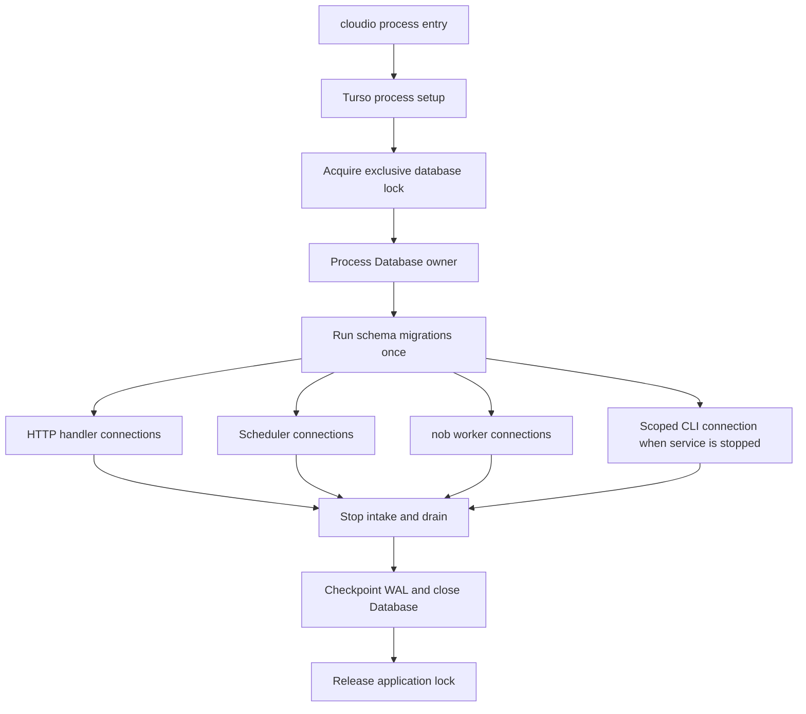

# Cloudio SQLite-to-turso.zig migration specification

Status: proposed

Audit baseline: 2026-08-02

Scope: replace Cloudio's direct SQLite C integration with the adjacent
`turso.zig` safe API while preserving the existing local database, schema,
operator workflows, and recovery guarantees.

This is an implementation and cutover plan, not authorization to run a
migration against the live database. Every rehearsal and test that needs
production-shaped data must use a verified copy.

## 1. Decision summary

The recommended migration is deliberately narrow:

- Use local, embedded Turso only. Do not add Turso Cloud, remote sync, MVCC,
  encryption, FTS, or experimental multiprocess WAL.
- Keep the current database path and SQLite file format. Do not redesign the
  schema or transform application rows as part of the driver migration.
- Pin the exact reviewed `turso.zig` commit in `build.zig.zon`; do not commit a
  `../turso.zig` path dependency or a moving branch.
- Create one process-scoped Turso `Database` owner. Derive scoped
  `Connection` values for HTTP connection handlers, scheduler work, nob
  workers, migrations, and DB-backed CLI commands.
- Preserve Cloudio's repository boundary. Move remaining SQL and engine calls
  out of `src/app/` and collectors; do not introduce an ORM or a permanent
  SQLite/Turso driver abstraction.
- Make the service the only online database owner. A standalone DB-backed CLI
  command is offline-only and must acquire the same exclusive application
  lock. Commands that do not need the database must stop opening it.
- Never let SQLite and Turso access the database concurrently. The pinned
  upstream explicitly excludes mixed-engine multiprocess access.
- Replace the SQLite online-backup API with a verified `VACUUM INTO` snapshot.
  Replace in-place `VACUUM` with an offline, verified rebuild-and-swap, and
  remove `PRAGMA optimize`.
- Cut over from a cleanly checkpointed copy, with no simultaneous writers and
  no schema change in the cutover release. Retain the old executable and the
  pre-cutover database until the rollback window closes.
- Qualify behavior end to end before cutover. The migration is not complete
  merely because the project compiles or repository unit tests pass.

The key product tradeoff is online standalone CLI access. This specification
selects the smallest safe behavior: while `cloudio serve` owns the database,
DB-backed standalone commands fail with a precise instruction to use the web
surface or stop the service. If concurrent online CLI workflows are a firm
product requirement, add a narrow authenticated local control socket for
those specific application operations before cutover. Do not solve that
requirement by enabling Turso's experimental multiprocess WAL.

## 2. Outcomes and definition of success

The migration succeeds when all of the following are true:

1. A current Cloudio SQLite database opens directly through Turso after a
   clean checkpoint; schema version 18 and all application data remain intact.
2. Cloudio's authenticated pages, forms, JSON endpoints, provider collection,
   scheduler, nob workers, deployment workflows, authentication, maintenance,
   and CLI output preserve their observable contracts.
3. Every multi-statement mutation retains its previous atomicity, including
   failure and rollback behavior.
4. Backup, restore, compaction, clean shutdown, crash restart, and old-binary
   rollback have been executed against production-shaped copies.
5. The service prevents a second Cloudio process from opening the same database
   and documents that external `sqlite3` access is offline-only.
6. The production executable no longer links the system `sqlite3` library and
   no production source imports `sqlite` or calls `sqlite3_*`.
7. Rust/Cargo and the C toolchain are build-time dependencies only. The static
   production artifact has no Turso or SQLite shared-library runtime
   dependency.
8. The release meets recorded correctness, latency, throughput, memory, disk,
   and backup-duration acceptance thresholds on the deployment target.

## 3. Non-goals

Keep these out of this migration unless a failing acceptance gate proves they
are required:

- schema redesign, table renaming, retention-policy changes, or historical
  data cleanup;
- an ORM, query builder, generic datastore interface, or long-lived dual-driver
  compatibility layer;
- a connection pool; scoped connections preserve the current model until
  measurement demonstrates a pool is necessary;
- Turso Cloud, remote replication, sync credentials, or a database server;
- encryption-at-rest migration;
- FTS or any new SQL feature;
- experimental `multiprocess_wal`, MVCC, in-place vacuum, autovacuum writes, or
  any other compatibility feature flag;
- UI redesign, provider feature work, or unrelated application cleanup;
- a new smoke-test suite. Extend the existing end-to-end acceptance coverage
  and add focused integration tests instead;
- keeping SQLite linked as an automatic runtime fallback.

## 4. Current-state audit

### 4.1 Code and schema

Cloudio currently builds a translated C module from `c/sqlite.h`, links the
system `sqlite3` library, and passes raw `*sqlite.sqlite3` and
`*sqlite.sqlite3_stmt` values through the persistence layer. The engine is not
isolated to one file:

- 21 source modules import `sqlite`: 13 under `src/db/`, 6 under `src/app/`,
  and 2 collectors.
- The largest direct-call surfaces are deploy, Caddy desired-state,
  maintenance, topology, shared write helpers, and the nob repository.
- Application code owns statement stepping, binding, finalization, and raw
  `BEGIN`/`COMMIT`/`ROLLBACK` sequences in several workflows.
- `src/db/connection.zig` opens a new SQLite handle, sets a 5-second busy
  timeout, and enables foreign keys for each handle.
- `src/db/schema.zig` contains 18 ordered migrations. The current schema has 48
  application tables and 44 explicit indexes.
- Schema application enables WAL and `synchronous=NORMAL`, creates
  `schema_meta`, and runs each unapplied migration inside `BEGIN IMMEDIATE`.
- `src/app/maintenance.zig` depends on `sqlite3_backup_*`, passive/truncate WAL
  checkpoints, in-place `VACUUM`, `PRAGMA optimize`, and integrity checks.

The SQL compatibility scan found no current `WITH RECURSIVE`, unsupported
window-frame syntax, `WITHOUT ROWID`, or view creation. The material known
incompatibilities are maintenance pragmas, statement/row ownership, and
transaction execution. A static scan is only an inventory; every statement
still needs execution against both clean and populated fixtures.

### 4.2 Runtime ownership

The current process model matters more than the file format:

- the HTTP server opens database handles for accepted connections;
- the scheduler opens its own handles during cycles;
- nob worker threads own database handles;
- detached threads do not currently participate in a complete stop, join,
  connection drain, checkpoint, and owner-close sequence;
- the CLI opens an initialized database near the top-level dispatch path,
  including for commands that may not need persistence; and
- separate CLI and service processes can currently access SQLite concurrently.

Turso permits multiple connections derived from one `Database`, including
connections used from multiple threads. It requires every connection to be
destroyed before the parent `Database`, and the allocator supplied to
`Database.open` must remain thread-safe for the full shared lifetime. The
binding also permits only one active execution or rows lease on a connection.

### 4.3 Point-in-time storage baseline

Read-only inspection on 2026-08-02 observed:

| Item | Observed value |
| --- | ---: |
| Main database | about 6.49 GB / 6.05 GiB |
| WAL | about 91 MB |
| Schema version | 18 of 18 |
| Page size | 4,096 bytes |
| Freelist pages | 0 |
| Foreign-key violations | 0 |
| `snapshots` rows | 905,878 |
| `provider_raw` rows | 849,334 |
| `hostinger_metrics` rows | 2,883 |
| `system_metrics` rows | 14,410 |
| `audit_events` rows | 3,020 |
| `audit_actions` rows | 4 |

These values are sizing evidence, not hard-coded assertions. Recompute them at
each rehearsal and cutover. The filesystem currently has ample free space,
but the cutover gate must still require free bytes for the live database, an
immutable rollback copy, a candidate/rebuild file, sidecars, and at least 20%
working margin. At the current size, reserve at least 20 GiB and prefer 25 GiB
free before starting.

## 5. Selected dependency and build profile

The adjacent checkout was inspected at:

| Component | Selected baseline |
| --- | --- |
| `turso.zig` | commit `f1b82da9f9207bee085808ad6a8686a9780ed76d` |
| Binding package version | unreleased `0.1.1` development state |
| Zig | `0.17.0-dev.1509+bb296ab9b` |
| Turso SDK Kit | `0.8.0-pre.2`, commit `6e527a75595576790566f3d36560fbe95c5d87a2` |
| Default native backend | source build |
| Linkage | static |
| Required native build tools | Rust/Cargo 1.88+, C toolchain |

Cloudio's current exact Zig version matches this binding baseline. The binding
and SDK are new, unofficial/pre-1.0 inputs, so exact pinning and workload
qualification are release gates rather than administrative details.

### Required build choices

- Add `turso` to `build.zig.zon` by immutable Git revision and commit the
  resolved package hash.
- Resolve the reviewed baseline with
  `zig fetch --save=turso git+https://github.com/tzekid/turso.zig#f1b82da9f9207bee085808ad6a8686a9780ed76d`,
  then review the resulting URL/hash rather than relying on the command text
  alone.
- Use the local sibling checkout only for review and optional developer
  overrides. CI and release builds must prove the recorded dependency works
  without the parent workspace.
- Select source mode and static linkage initially.
- Set `encryption = false`, `fts = false`, and `sync = false`; Cloudio does not
  use those capabilities.
- Import `turso` only into the database implementation modules. Add an
  architecture check that rejects engine imports from application, provider,
  server, collector, and CLI modules.
- Remove the translated SQLite C module, every `linkSqlite` call, the
  `c/sqlite.h` shim, and the system SQLite link once the Turso implementation
  passes all gates.
- Update CI to install/pin the required Rust toolchain and validate a clean
  source/static build. Cache build products, but prove at least one clean build
  so a warm developer cache cannot hide a missing tool or source input.
- Build the deployable artifact in `ReleaseSafe`. Inspect it with the platform
  dependency tool and reject any unexpected `libsqlite3`, Turso, Rust runtime,
  or build-host path dependency.
- Retain license and notice material required by the statically linked native
  dependencies.

The current binding supports Linux glibc x86-64 as tier 1 and Linux glibc
ARM64 as tier 2; Linux musl is unsupported. Detect and record the actual
production architecture/libc before implementation is declared shippable.

## 6. Compatibility decisions

The pinned Turso source promises SQLite database-file compatibility and the
ability to return to SQLite, but explicitly does not support mixed SQLite and
Turso multiprocess access. File compatibility removes the need for a row-copy
migration; it does not remove the need for a controlled cutover.

| Area | Current SQLite behavior | Turso baseline | Required treatment |
| --- | --- | --- | --- |
| File format | SQLite format 3 | Compatible | Open only a verified copy until cutover; checkpoint before engine changes |
| Journal | WAL | WAL | Assert WAL on startup; never copy only the main file while a writer is live |
| Synchronous mode | `NORMAL` | only `OFF` and `FULL` supported | Select and verify `FULL`; benchmark the durability/performance change |
| Foreign keys | enabled per handle | supported | Set `foreign_keys=ON` and query it back on every connection |
| Busy handling | native 5-second timeout | connection busy timeout supported | Set 5,000 ms; do not add generic retries unless contention tests prove a gap |
| Transactions | raw SQL control statements | typed exclusive `Transaction` | Use `Connection.begin`; all work flows through the transaction; explicit commit/rollback |
| SQL scripts | `sqlite3_exec` executes all statements | one-shot `exec` executes one statement; `execBatch` executes the script | Use `execBatch` only where a full script is intended; wrap it in a typed transaction when atomicity is required |
| Rows/text ownership | copied or SQLite-lifetime-dependent | row text/blob is borrowed until the next statement operation | Copy into caller-owned result models before advancing or returning |
| Active statements | several call sites keep/nest statements | one active execution/rows lease per connection | Finish/deinit rows before any nested query or write on that connection |
| Last inserted ID | `sqlite3_last_insert_rowid` | supported | Read from the same connection/transaction immediately after the insert |
| Backup | `sqlite3_backup_*` | safe binding exposes no backup API | Use verified `VACUUM INTO` to a sibling temporary file, then publish atomically |
| In-place compaction | plain `VACUUM` | experimental | Do not enable; rebuild to a verified file offline and swap |
| Planner maintenance | `PRAGMA optimize` | unsupported | Remove; use `ANALYZE` only if measured plans require it |
| Integrity | `integrity_check` | supported | Require `ok` for source/candidate/backup |
| Foreign-key audit | `foreign_key_check` | unsupported | Run stock SQLite only while Cloudio is stopped during rehearsal/cutover; cover enforcement through Turso integration tests |
| Window query | `ROW_NUMBER` default frame | supported | Execute current retention/pruning query on production-shaped data |
| Multiprocess | SQLite service and CLI can coexist | mixed engines unsupported; experimental Turso multiprocess is not production-ready | One process owner plus an OS lock; no experimental feature |

### Known code hotspots

The port must explicitly repair these shapes rather than transliterate C calls:

- maintenance table-stat functions step a row and call another scalar query
  before the first statement is finalized;
- deploy port assignment keeps multiple prepared statements and alternates
  their execution;
- migrations depend on multi-statement script execution inside an immediate
  transaction;
- several app workflows own raw transaction strings and cleanup paths;
- repository result builders currently read borrowed SQLite column pointers
  directly into allocated models; and
- some tests prepare or step another statement while a prior row remains live.

The Turso wrapper catches many ownership violations, often as `InvalidState`
or a destruction-order panic. Treat either as a code defect, not a transient
database failure.

## 7. Target architecture

### 7.1 Ownership model

Introduce two concrete database-layer types; names may follow existing module
conventions, but their ownership must remain visible:

1. `Database` is the move-only process owner. It owns the application lock,
   `turso.Database`, shutdown state, and active-connection count. It runs
   process-global Turso setup before threads start, applies migrations once,
   creates connections, refuses new connections during shutdown, waits for
   children, checkpoints, and closes.
2. `Db` (or `Session`) is a move-only scoped owner of one
   `turso.Connection`. It exposes the current repository views and small
   database primitives. Its deinit closes every statement/rows/transaction
   child before releasing the connection count.



Use a thread-safe process allocator for the `Database` and all derived
connections. Do not put a thread-local arena behind the shared owner. Request
or operation result allocation may continue using narrower allocators after
borrowed Turso values have been copied.

For `serve`, construct this owner in the top-level command path, keep it at a
stable address until every child thread has joined, and pass `*Database` into
the server, scheduler, and nob runtime contexts. Those children call
`connect()`; they no longer accept a path and reopen the database themselves.
The one-shot CLI path constructs its own owner only after dispatch determines
that the selected command needs persistence.

### 7.2 Connection scopes

- HTTP: retain one connection per accepted HTTP connection/handler scope to
  match current ownership initially. Close it before the handler thread exits.
- Scheduler: use a connection scoped to a cycle unless current behavior needs
  state across the cycle. Never leave row iterators alive across sleeps.
- Nob workers: one connection per worker lifetime is acceptable; release it
  before the worker reports joined.
- Startup/migrations: use a dedicated connection before the listener,
  scheduler, or workers start.
- Maintenance: online backup uses its own connection from the process owner;
  rebuild-and-swap compaction runs only in an offline command after acquiring
  the exclusive lock.
- CLI: dispatch and validate arguments first. Open the database only for a
  command that actually needs it.

Scheduler and worker `start` functions must return owned thread handles to the
top-level runtime. Detached database-using threads are incompatible with a
provable owner shutdown sequence.

Do not add a pool in the first migration. Turso already derives concurrent
connections from one database owner, and Cloudio currently creates scoped
handles. Add a bounded pool later only if connection creation or uncontrolled
concurrency is measured as a production problem.

### 7.3 Process exclusion

Acquire an OS-backed exclusive lock at a deterministic sibling path before
opening Turso. The service holds it for its full database lifetime. Every
offline DB-backed CLI path uses the same lock.

Requirements:

- The kernel lock, not a PID file's contents, is authoritative.
- Diagnostic metadata may record PID, start time, command, database path, and
  engine, but stale metadata must never be treated as a live lock.
- Lock acquisition failure must not open the database. Report which process
  appears to own it and how to proceed safely.
- Resolve/canonicalize the database path so aliases cannot create two lock
  names for one file.
- External `sqlite3`, backup scripts, and old Cloudio binaries are documented
  as offline-only after cutover.
- Tests must prove two DB-backed processes cannot proceed simultaneously.

### 7.4 Database-layer boundary

The final source rule is:

```text
src/app, src/server, src/collectors, src/providers, src/cli
                         |
                         v
                 Cloudio Db/repositories
                         |
                         v
                     turso.zig
```

Application modules express application operations, not statement mechanics.
Repository/database modules own SQL, binding, row decoding, and transaction
boundaries. Cross-repository atomic workflows should be implemented as a
focused database-layer operation or accept a transaction-scoped executor; do
not expose raw Turso handles broadly to recreate the current leak.

Keep one stable application error vocabulary such as open, busy, constraint,
query, integrity, shutdown, and invalid-state failures. Preserve domain errors
such as project-busy, duplicate request, and not-found. Attach native
diagnostics to redacted logs, but do not leak engine-specific error names or
bound secret values into HTTP/CLI contracts.

## 8. SQL and repository porting rules

Apply these rules consistently:

1. Use `execParams`/`queryParams` or a reusable `Statement`; never interpolate
   data into SQL.
2. Use `exec` for exactly one statement. Use `execBatch` only when the input is
   intentionally a script. Its previous statements are not rolled back if a
   later statement fails unless it runs through a typed transaction.
3. Use `Connection.begin(.immediate, ...)` for current `BEGIN IMMEDIATE`
   semantics. Perform every operation through the returned transaction until
   commit or rollback.
4. A transaction's `deinit` is the last-resort rollback guard; expected error
   paths should still request rollback and surface a rollback failure.
5. Deinit or finish the current rows iterator before any other operation on the
   connection. Refactor nested scalar calls and alternating statements into
   sequential scopes or one query.
6. Copy all text/blob values that must outlive the current row advance. Tests
   must exercise multiple rows so a borrowed-value bug cannot pass on a
   single-row fixture.
7. Read `lastInsertRowId` on the same transaction/connection before yielding
   it to unrelated work.
8. Classify `Busy` and `BusySnapshot` as retryable at the application boundary,
   but do not automatically replay a transaction or multi-statement batch.
   Start with the native 5-second timeout and add a bounded retry only if a
   repeatable test demonstrates a safe, idempotent operation that needs it.
9. Give statements and rows the smallest lexical lifetime. Destruction-order
   panics, poisoned connections, or leaked children fail tests.
10. Keep diagnostics bounded and redacted. Log a stable operation label,
    native status, and safe SQL identifier/preview only when useful; never log
    parameter values by default.

### Schema migration runner

Port the existing 18 migrations without changing their SQL or version numbers
unless a compatibility test identifies a required correction. The runner must:

- create/read `schema_meta` through Turso;
- reject a database newer than the executable;
- begin one immediate typed transaction per unapplied migration;
- execute the complete migration script through the transaction's
  `execBatch`, insert its version, and commit;
- roll back and leave the version unapplied on any failure;
- never run concurrently with another process, backup, listener, scheduler, or
  worker;
- verify version 18 after startup; and
- test every upgrade path represented by retained fixtures, including empty to
  18 and the currently deployed version to 18.

The cutover release must not add migration 19. Separating the engine change
from a schema change makes old-binary rollback testable and attributable.

## 9. Maintenance and recovery design

### 9.1 Online backup

Replace `sqlite3_backup_*` with a database-layer backup operation using
`VACUUM INTO`. It may run while the service owns the database, but never during
schema migration or shutdown.

The online method accepts a destination, not an arbitrary source path, and
operates through the already-open process `Database` owner. A reusable offline
helper may accept a source path, but it must apply the source checks below
before opening it.

Publication sequence:

1. Confirm the owner still refers to the canonical configured live database
   and that it has at least one application table. For an offline helper,
   validate that the source exists, is a regular SQLite-format file, and is not
   a symlink before opening it. Turso open creates a missing database, so a
   caller-supplied source must be rejected before that can happen.
2. Validate the destination policy and free space. Reject the live path,
   sidecars, symlinks outside the backup directory, and unexpected existing
   destinations.
3. Build a unique sibling temporary path owned by the current process.
4. Execute a safely quoted `VACUUM INTO` through a dedicated connection.
5. Open the temporary snapshot through Turso and require
   `PRAGMA integrity_check` to return exactly `ok`.
6. Compare the stable source/snapshot application-table inventory and schema
   version. Record the snapshot row-count/ID manifest and verify its internal
   authentication, nob, foreign-key, and sequence invariants. Do not require
   exact row equality with an online source that collectors may have advanced;
   exact source/snapshot logical equality is a stopped-writer rehearsal and
   cutover gate.
7. Confirm AUTOINCREMENT state, including `sqlite_sequence`, is internally
   consistent and preserved in every stopped-writer parity test.
8. Remove temporary Turso sidecars after closing verification handles.
9. Set the temporary file to mode `0600`, sync it, rename it atomically into
   the published destination, then sync the parent directory so the rename is
   durable.
10. Reopen the published file and repeat the cheap integrity/version checks.
    Only then report success or apply retention.
11. Persist a mode-`0600` companion manifest containing the snapshot checksum,
    byte size, schema/engine versions, table inventory, row-count/ID summary,
    creation time, and source identity. Publish it atomically and retain/delete
    it with the snapshot.

Production-derived testing of the adjacent Sparkdate implementation found that
Turso `VACUUM INTO` can materialize bookkeeping tables named with the
`__turso_internal` prefix for AUTOINCREMENT state. Cloudio must qualify this
against its own production-shaped copy. Backup comparisons may ignore only
known and tested engine tables (`sqlite_*` and validated
`__turso_internal*`), while separately verifying `sqlite_sequence`; they must
not weaken comparison for arbitrary unknown tables.

### 9.2 Restore

Restore is offline and explicit:

- stop Cloudio and acquire the exclusive database lock;
- verify the backup header, permissions, size, schema version, integrity,
  application table inventory, and logical manifest before touching the live
  path;
- preserve the current live file as a timestamped recovery candidate;
- place and fsync the verified backup at a temporary sibling path;
- atomically rename it to the configured path and fsync the parent directory;
- remove stale sidecars only after every old handle is closed;
- start Cloudio, verify startup configuration and full acceptance workflows;
  and
- retain the displaced file until the restore is signed off.

The end-to-end test must restore a backup into an empty directory and run the
real executable against it. Testing only that the backup file opens is not
sufficient.

### 9.3 Prune, checkpoint, and compact

- Keep bounded retention deletes, but port them to typed transactions and
  execute the current `ROW_NUMBER` query on production-shaped data.
- Keep passive checkpoint for normal maintenance if measurement shows value.
- During clean process shutdown, after draining every child connection, run a
  truncate checkpoint and then close the database owner.
- Replace online plain `VACUUM` with an offline rebuild: acquire the exclusive
  lock, create a verified `VACUUM INTO` candidate, close all handles, fsync,
  retain the old main file, atomically promote the candidate, and reopen it.
- Remove `PRAGMA optimize`. Add `ANALYZE` only in a separate measured change if
  query plans demonstrate a need.
- Do not enable the experimental in-place-vacuum feature to preserve the old
  command name. The CLI may retain `compact` as the user-facing operation but
  its implementation and help text must describe rebuild-and-swap.

## 10. Shutdown and crash behavior

Graceful shutdown is part of the storage migration, not optional cleanup.

1. Stop accepting HTTP connections and refuse new database connections.
2. Signal scheduler and nob workers to finish or cancel at safe boundaries.
3. Join every database-using thread within a documented systemd stop timeout.
4. Wait for the active connection count to reach zero; emit bounded diagnostics
   for owners that fail to drain.
5. Run `PRAGMA wal_checkpoint(TRUNCATE)` on a final administrative connection.
6. Close the connection, deinit the `turso.Database`, and release the lock.

If the drain timeout expires, report failure and leave the owner alive until
the process is terminated; never deinit a parent with live children. Forced
termination is tested as a crash scenario: restart must recover committed
transactions, reject partial transactions, pass integrity checks, and preserve
authentication and worker invariants.

## 11. Verification strategy

Testing priority is end-to-end, then integration, then focused unit coverage.
Do not create parallel test hierarchies for SQLite and Turso or a separate
smoke suite.

### 11.1 Frozen fixtures and reference artifacts

Before changing the engine:

- save the exact old Cloudio executable and its build metadata;
- create a small deterministic version-18 fixture covering every table,
  constraint, NULL/value kind, AUTOINCREMENT sequence, and repository workflow;
- create fixtures for every retained schema upgrade starting point;
- create a verified production-derived copy containing realistic large JSON,
  pagination, retention, auth, provider, deploy, topology, and nob data;
- record a redacted logical manifest and representative CLI/API/HTML outputs;
  and
- record performance/resource baselines on the deployment target.

The old and new executables run sequentially against separate copies of each
fixture. Never compare them by opening one file concurrently.

### 11.2 End-to-end acceptance

Run the real Cloudio executable over real HTTP and the Turso file. Extend the
existing authenticated browser acceptance coverage rather than adding another
runner. At minimum cover:

- first start from an empty directory and restart from a populated database;
- login, passkey registration/authentication/removal boundaries, sessions, and
  CSRF/origin/cookie/security-header behavior;
- every native page at desktop and mobile widths, with JavaScript enabled and
  disabled except WebAuthn's required browser ceremony;
- dashboard, projects, routes, DNS, VPS, Docker, audit, security, and settings
  reads with populated, empty, stale, and error states;
- representative successful and failed mutations, followed by a fresh read
  proving committed state or rollback;
- provider collection into snapshots and normalized inventory;
- scheduler overlap prevention and nob job claim/finish/failure recovery;
- CLI text/JSON contracts for DB-backed and non-DB commands;
- service-held lock rejection for a second DB-backed process;
- clean restart, forced termination/recovery, online backup, restore into a new
  directory, offline compact, and old-binary rollback; and
- no unexpected browser console, CSP, database, panic, or leak diagnostics.

### 11.3 Integration coverage

Use focused executable/database integration tests for cases that are too slow
or awkward in the browser:

- all 18 migrations and migration rollback on an injected middle-statement
  failure;
- every repository query against clean and production-shaped fixtures;
- nested/alternating statement hotspots after they are made sequential;
- text/blob ownership across multiple row advances;
- constraint, NULL, integer, real, text, and blob round trips;
- immediate transaction contention, busy timeout, rollback, and connection
  reuse after errors;
- concurrent HTTP, collector, scheduler, and worker connections from one
  `Database` owner using the production allocator;
- refusal to destroy connections with live rows/statements/transactions;
- shutdown refusing new connections and waiting for existing work;
- backup failure at each stage, including full disk, invalid destination,
  empty/missing source, failed integrity, rename failure, and stale sidecars;
- backup content and AUTOINCREMENT parity;
- restore/rebuild atomicity and retained rollback file;
- source/candidate/old-binary opening after clean checkpoints; and
- two-process lock contention.

### 11.4 Focused unit coverage

Unit-test only policy and parsing that do not need a real database: safe path
validation, lock metadata formatting, error classification, SQL-script shape
guardrails if introduced, backup table filtering, and manifest comparison.

### 11.5 Performance and reliability gates

Record thresholds before the Turso port so they cannot be chosen to bless the
result. Measure at minimum:

- service startup and migration check;
- authenticated page p50/p95 latency;
- provider refresh duration and rows written per second;
- scheduler/nob claim latency under concurrency;
- large JSON insert/read memory and latency;
- database/WAL growth during a representative collection cycle;
- backup duration, maximum temporary disk use, and restore duration;
- clean shutdown/drain duration; and
- resident memory under normal and peak concurrent connections.

The durability change from `synchronous=NORMAL` to `FULL` may change write
latency. Prefer correctness; if a recorded product threshold fails, profile
and reduce transaction/statement overhead before considering weaker
durability.

## 12. Phased implementation plan

Each phase is independently reviewable and has an exit gate. Do not begin live
cutover work while an earlier gate is open.

### Phase 0: freeze contracts and prove prerequisites

Work:

- Record the exact current schema, SQL inventory, engine call sites, runtime
  ownership, production target, and storage sizing.
- Produce the old executable, deterministic fixtures, production-derived copy,
  logical manifests, observable output snapshots, and performance baselines.
- Pin the reviewed `turso.zig` commit in an isolated branch and prove a clean
  source/static build on CI and the target host.
- Run the binding's relevant database, concurrency, disk-fault, and downstream
  consumer tests for the exact pin.
- Confirm the selected single-process/offline-CLI behavior with operations and
  document the lock contract.
- Freeze schema version 18 for the migration release.

Exit gate:

- Inputs are reproducible; platform, toolchain, disk, fixtures, rollback
  artifact, and product behavior decisions are recorded.
- Turso opens a disposable copy of the current database, passes integrity, and
  executes the read-only qualification query set.

### Phase 1: close the database boundary while SQLite still runs

Work:

- Move raw SQL/statement mechanics out of `src/app/` and collectors into
  focused repositories or database-layer workflow methods.
- Make CLI database opening lazy and command-specific.
- Preserve domain-level APIs and observable output.
- Add an architecture check that prevents new direct engine imports outside
  the database implementation.
- Characterize every multi-statement transaction and nested statement hotspot
  with integration tests before refactoring it.

Do not build a cross-driver interface. This phase merely makes one concrete
implementation replaceable and reduces the final all-at-once surface.

Exit gate:

- SQLite remains the only engine, all current checks and expanded end-to-end
  acceptance pass, and no app/collector module imports `sqlite`.

### Phase 2: add the Turso owner and port the database core

Work:

- Add process-global `turso.setup`, the exclusive lock, process `Database`
  owner, scoped `Db` connection, diagnostics/error mapping, and shutdown
  accounting.
- Configure and verify foreign keys, WAL, `synchronous=FULL`, and 5-second busy
  timeout.
- Port helpers, row decoding, schema versioning, and all migrations.
- Use the thread-safe production allocator and enforce move-only destruction
  order through APIs and tests.
- Port the deterministic fixture first; do not touch the live database.

Exit gate:

- Empty-to-18 and retained upgrades are atomic; source/static builds are
  reproducible; ownership, concurrency, and crash tests pass.

### Phase 3: port repositories and application workflows

Recommended order:

1. captures and audit;
2. inventory/system reads;
3. Cloudflare and Hostinger collectors;
4. authentication;
5. nob repository and workers;
6. topology, writes, Caddy desired state, and deploy workflows; and
7. maintenance.

For each slice, run its real repository integration tests and the affected
HTTP/CLI end-to-end workflows. Materialize borrowed data and eliminate active
statement overlap as part of the same slice.

Exit gate:

- The complete application runs only through Turso on deterministic fixtures;
  domain errors, transactions, pages, APIs, and CLI outputs match the frozen
  contracts.

### Phase 4: complete operations and remove SQLite linkage

Work:

- Implement connection drain and clean shutdown.
- Implement and fault-test verified backup, restore, and offline compact.
- Update systemd stop behavior, deployment prerequisites, operator docs, and
  database diagnostics.
- Remove SQLite source imports, translated C module, system link, header shim,
  and fallback code.
- Add an architecture/build gate proving they cannot return accidentally.

Exit gate:

- Clean build has no SQLite linkage; backup/restore/compact and old-binary
  rollback pass against deterministic and production-shaped copies.

### Phase 5: full production-shaped qualification

Work:

- Run old and new executables sequentially against cloned production-shaped
  databases and compare logical manifests plus operator-visible behavior.
- Execute the full authenticated browser, HTTP, provider, scheduler, nob,
  concurrency, crash, backup, restore, compact, and rollback acceptance set.
- Run sustained collection/write load long enough to observe WAL, memory,
  busy/lock behavior, and retention.
- Compare performance/resource results to the predeclared thresholds.
- Rehearse the exact cutover and rollback runbooks on the deployment host or an
  equivalent filesystem/systemd environment.

Exit gate:

- All differences are explained and accepted; zero unresolved integrity,
  transaction, ownership, lock, durability, or rollback failures remain.

### Phase 6: controlled production cutover

Use the runbook in section 13. Schedule a maintenance window even though no
row-copy transformation is required. Keep unrelated deploys, schema changes,
provider feature changes, and retention changes out of the window.

Exit gate:

- The Turso release is healthy through the observation window, current backup
  and restore evidence exists, and the old binary has successfully opened a
  cleanly checkpointed post-Turso copy during rehearsal.

### Phase 7: close the rollback window

- Take and verify a fresh Turso backup.
- Confirm retention and disk-use behavior over at least one normal collection
  and maintenance cycle.
- Archive the release evidence and exact dependency/build provenance.
- Remove the pre-cutover rollback file only under the normal retention policy
  and only after explicit sign-off.
- Future schema migration 19 may proceed in a separate release.

## 13. Production cutover runbook

Exact commands belong in the implementation's operations guide; the required
state sequence is fixed here.

### Pre-window

1. Confirm the candidate executable checksum, dependency provenance, target
   architecture, systemd unit, configuration, and rollback executable.
2. Re-run the end-to-end and production-shaped qualification for that exact
   artifact.
3. Measure current database/WAL/backups and require the disk-space formula from
   section 4.3.
4. Verify the most recent backup by restoring it into a disposable directory
   and running Cloudio against it.
5. Block unrelated deploys and schema changes.

### Stop and preserve

1. Stop the old service gracefully and verify no Cloudio process or SQLite
   handle remains.
2. With stock SQLite, checkpoint/truncate the WAL, run `integrity_check`, run
   `foreign_key_check`, verify schema version 18, and capture the logical
   manifest.
3. Preserve a byte-for-byte, mode-preserving, fsynced pre-cutover copy and its
   manifest/checksum. Never run Turso against this rollback copy.
4. Create a separate candidate copy at the live path; verify its checksum and
   confirm no stale `-wal`, `-shm`, or Turso sidecars are carried over.

### Start and validate

1. Start the Turso candidate. It must acquire the lock, verify runtime/native
   version, configure the connection, observe schema 18, and start no migration.
2. Before reopening public access, run local authenticated acceptance covering
   login, representative reads, one reversible write/rollback workflow,
   scheduler/worker health, and database diagnostics.
3. Take and verify the first Turso backup.
4. Reopen normal access and watch structured database errors, busy events,
   panics, worker failures, WAL/database growth, latency, memory, and disk.
5. Run the full post-cutover acceptance set and record evidence.

### Observation window

Keep the rollback executable and immutable pre-cutover copy available. Use a
short, explicit high-attention window followed by at least one complete normal
collection/maintenance cycle before closing rollback eligibility.

## 14. Rollback plan

Rollback has two paths. Rehearse both.

### Preferred: preserve post-cutover writes

This path depends on the cutover release retaining schema version 18 and the
old binary proving it can open a clean post-Turso file during rehearsal.

1. Stop the Turso-backed Cloudio service gracefully, drain all connections,
   and truncate-checkpoint the WAL.
2. Preserve a copy of the failed state for diagnosis.
3. Open a separate copy with the old executable/stock SQLite and run integrity,
   foreign-key, manifest, authentication, and critical workflow checks.
4. If they pass, start the old executable against the current clean database.
5. Verify the lock, pages, providers, auth, scheduler, nob, backup, and one
   reversible mutation.

### Last resort: restore the pre-cutover database

If the current file cannot be safely opened by the old release:

1. Stop all Cloudio/database processes and preserve the failed current file.
2. Restore the immutable pre-cutover copy atomically using the offline restore
   procedure.
3. Start the old executable and run its full acceptance checks.
4. Explicitly report the interval of post-cutover writes that was discarded
   and reconcile any external provider/system changes whose database audit
   record was lost.

Never alternate engines repeatedly on the same live file while diagnosing a
failure. Work on disposable copies and make one deliberate promotion.

## 15. Operational diagnostics

Extend the existing maintenance/doctor output so an operator can see, without
opening the file manually:

- engine name and pinned binding/native runtime versions;
- database canonical path and lock owner metadata;
- schema version expected/applied;
- foreign-key state, journal mode, synchronous mode, and busy timeout;
- main file and known sidecar sizes;
- last successful checkpoint, backup, restore test, prune, and compact;
- active connection count and shutdown state;
- integrity-check status and timestamp;
- application table count and key row-count/storage trends; and
- unsupported/offline-only operation guidance.

Do not expose database paths, SQL, diagnostics, or counts that reveal secrets
to unauthenticated HTTP clients. Logs and UI retain Cloudio's existing
redaction and authorization boundaries.

## 16. Risk register

| Risk | Consequence | Prevention / evidence |
| --- | --- | --- |
| Mixed SQLite/Turso processes | corruption or undefined locking behavior | exclusive application lock, offline tooling, two-process tests, no experimental multiprocess |
| Statement/row lifetime mismatch | invalid state, panic, overwritten text/blob | sequential scopes, owned decoding, multi-row tests, leak/destruction checks |
| Partial SQL script | schema or workflow only partly applied | distinguish `exec`/`execBatch`; typed transaction around atomic scripts; injected-failure tests |
| Transaction cleanup mismatch | partial or silently rolled-back mutation | typed transactions, explicit commit/rollback, domain end-to-end assertions |
| `synchronous=FULL` regression | refresh/worker latency increase | predeclared performance gates and profiling; do not weaken durability reflexively |
| Backup is valid but empty/incomplete | false recovery confidence | source-header/table guards, logical manifest, integrity, reopen, full restore acceptance |
| Internal Turso tables skew comparisons | false failure or hidden mismatch | qualify exact prefix behavior, filter only known engine tables, separately verify sequences |
| Missing graceful drain | parent destruction panic or uncheckpointed WAL | stop/join/count/checkpoint lifecycle and forced-shutdown tests |
| Pre-1.0 dependency drift | build/API/behavior changes | exact commit/hash, runtime version check, clean CI, deliberate promotion process |
| Native build reproducibility | deploy cannot be rebuilt | pinned Rust/Zig/native source, clean source/static CI, provenance archive |
| Platform mismatch | artifact cannot build or run | record glibc/architecture and execute target-native suite |
| Large database exhausts disk | failed backup/cutover, service outage | preflight formula, ENOSPC fault tests, temp cleanup, no operation below threshold |
| Old binary cannot read post-Turso state | rollback loses new writes | no schema change, clean checkpoint, rehearsal against post-Turso copy, immutable baseline backup |
| Generic retry duplicates effects | repeated mutation or inconsistent audit | no transaction/batch auto-retry; retry only proven no-effect idempotent operations |

## 17. Required artifacts and review slices

Expected implementation artifacts:

- pinned dependency/build changes and license notices;
- database owner, scoped connection, lock, configuration, diagnostics, and
  shutdown modules;
- ported repositories/workflow operations with no engine imports outside the
  database layer;
- migrated schema runner;
- verified backup, restore, compact, manifest, and rehearsal tooling;
- end-to-end and integration fixtures/evidence;
- operations runbook and systemd/deployment updates; and
- an exact cutover/rollback evidence record.

Recommended review slices:

1. characterization fixtures, ownership inventory, lazy CLI open, and database
   boundary cleanup while SQLite still runs;
2. exact dependency/build integration plus Turso owner/connection/lock/schema;
3. repository and transactional workflow ports in bounded functional groups;
4. lifecycle, backup/restore/compact, diagnostics, and SQLite removal;
5. production-shaped qualification and operational documentation; and
6. cutover evidence, which should contain no unrelated source changes.

Do not merge a half-migrated runtime that selects engines via configuration.
Feature branches may use fixtures and old/new executables for comparison, but
the deployable application has one storage engine.

## 18. Final release checklist

### Architecture and build

- [ ] Exact `turso.zig` commit and package hash are recorded.
- [ ] Exact Zig, Rust/Cargo, SDK Kit, target, and licenses are recorded.
- [ ] Clean source/static CI and target-native release builds pass.
- [ ] No production module imports `sqlite` or calls `sqlite3_*`.
- [ ] Final binary has no SQLite/Turso shared-library runtime dependency.
- [ ] No Turso experimental, sync, FTS, or encryption feature is enabled.

### Data and SQL

- [ ] Empty-to-18 and every retained upgrade path pass atomically.
- [ ] All repository statements execute on clean and populated fixtures.
- [ ] Source/candidate logical manifests match, excluding only validated engine
      bookkeeping.
- [ ] Foreign keys are enabled and enforced on every connection.
- [ ] WAL, `synchronous=FULL`, and 5-second busy timeout are verified.
- [ ] Active rows/statements and borrowed values pass ownership tests.
- [ ] Every transactional workflow proves commit and rollback behavior.

### Runtime and operations

- [ ] One process owner derives and drains every connection.
- [ ] Service/CLI and two-process exclusion tests pass.
- [ ] Graceful and forced restart tests pass.
- [ ] Online backup publishes only verified snapshots.
- [ ] Restore into an empty directory runs the real application successfully.
- [ ] Offline compact retains a verified rollback file and promotes atomically.
- [ ] Disk-space and ENOSPC behavior pass.
- [ ] Diagnostics expose engine/config/lock/health without secrets.

### Product acceptance

- [ ] Authenticated end-to-end workflows pass across all product sections.
- [ ] Native no-JavaScript behavior remains functional, except WebAuthn's
      required browser ceremony.
- [ ] Provider collection, scheduler, nob, deploy, topology, audit, and auth
      behavior match frozen contracts.
- [ ] CLI text/JSON and HTTP/HTML contracts match or have approved changes.
- [ ] Performance and resource thresholds pass on the deployment target.
- [ ] Exact cutover and both rollback paths have been rehearsed.
- [ ] Pre-cutover backup and old executable are retained through the observation
      window.
- [ ] A fresh post-cutover backup has been restored and accepted.

## 19. Local reference material

Implementation should be grounded in the exact pinned sources, not generic
Turso examples:

- `../turso.zig/README.md`: dependency pinning, build requirements, safe API,
  ownership, build options, and platform claims.
- `../turso.zig/docs/API.md`: complete safe API contracts.
- `../turso.zig/docs/PLATFORMS.md`: target and linkage support boundaries.
- the pinned upstream `COMPAT.md`: SQLite file/SQL/pragma compatibility and the
  explicit mixed-process exclusion.
- `../sparkdate/src/db.zig`: a local, production-shaped reference for
  process setup, connection ownership, typed transactions, verified
  `VACUUM INTO`, internal-table handling, shutdown drain, and fault tests.

Sparkdate is evidence and a source of tested patterns, not a module to copy
wholesale. Cloudio should keep its simpler scoped-connection model unless its
own measurements justify additional pooling or retry machinery.
